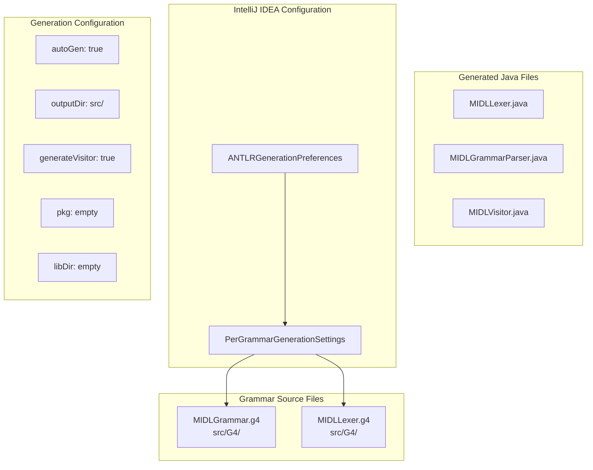
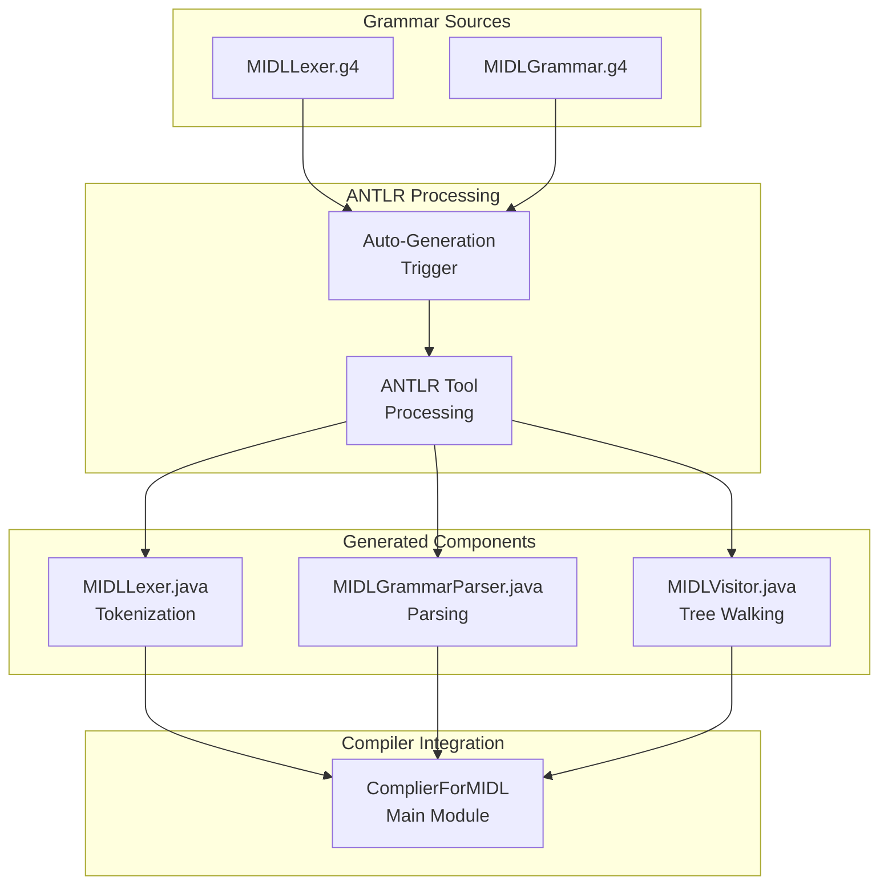

# ANTLR Integration

> **Relevant source files**
> * [.idea/misc.xml](https://github.com/yanzhe-Xiao/My-First-Complier-Work/blob/f0d8f425/.idea/misc.xml)

## Purpose and Scope

This document covers the ANTLR (ANother Tool for Language Recognition) framework integration within the MIDL compiler system. It details how ANTLR grammar files are configured for automatic code generation, the IDE-level generation preferences, and the workflow that produces the lexer, parser, and visitor components used by the compiler.

For information about the overall module configuration and dependencies, see [Module Configuration](/yanzhe-Xiao/My-First-Complier-Work/2.1-module-configuration). For details about the generated GUI components that may interact with the parser, see [GUI Components](/yanzhe-Xiao/My-First-Complier-Work/2.3-gui-components).

## ANTLR Generation Configuration

The ANTLR integration is configured through IntelliJ IDEA's ANTLR plugin preferences, which manages automatic code generation from grammar files. The system is configured to process two distinct grammar files with identical generation settings.

**ANTLR Integration Configuration Structure**

Sources: [.idea/misc.xml L3-L28](https://github.com/yanzhe-Xiao/My-First-Complier-Work/blob/f0d8f425/.idea/misc.xml#L3-L28)

## Grammar File Processing Pipeline

The ANTLR integration follows a streamlined generation pipeline where grammar files are automatically processed to produce Java source code. Both grammar files share identical generation settings, indicating a unified approach to language processing.

| Configuration Parameter | Value | Purpose |
| --- | --- | --- |
| `autoGen` | `true` | Enables automatic regeneration when grammar files change |
| `outputDir` | `src/` | Places generated files directly in source directory |
| `generateVisitor` | `true` | Creates visitor pattern classes for tree traversal |
| `pkg` | `""` | Uses default package (no package declaration) |
| `libDir` | `""` | No external ANTLR libraries specified |
| `encoding` | `""` | Uses system default encoding |
| `language` | `""` | Defaults to Java target language |

Sources: [.idea/misc.xml L8-L14](https://github.com/yanzhe-Xiao/My-First-Complier-Work/blob/f0d8f425/.idea/misc.xml#L8-L14)

 [.idea/misc.xml L18-L24](https://github.com/yanzhe-Xiao/My-First-Complier-Work/blob/f0d8f425/.idea/misc.xml#L18-L24)

## Code Generation Workflow

The ANTLR integration creates a seamless development workflow where grammar modifications automatically trigger regeneration of compiler components.

**ANTLR Code Generation and Integration Flow**

Sources: [.idea/misc.xml L7-L9](https://github.com/yanzhe-Xiao/My-First-Complier-Work/blob/f0d8f425/.idea/misc.xml#L7-L9)

 [.idea/misc.xml L17-L19](https://github.com/yanzhe-Xiao/My-First-Complier-Work/blob/f0d8f425/.idea/misc.xml#L17-L19)

## Grammar File Organization

The ANTLR integration manages two separate grammar files, each serving distinct roles in the language processing pipeline:

### MIDLLexer.g4

Located at `src/G4/MIDLLexer.g4`, this lexer grammar defines the tokenization rules for the MIDL language. The lexer is responsible for breaking input text into meaningful tokens that can be consumed by the parser.

### MIDLGrammar.g4

Located at `src/G4/MIDLGrammar.g4`, this parser grammar defines the syntactic structure and parsing rules for the MIDL language. It builds upon the tokens produced by the lexer to create a parse tree representation.

The separation of lexer and parser grammars follows ANTLR best practices for complex language implementations, allowing independent maintenance of tokenization and parsing logic.

Sources: [.idea/misc.xml L7](https://github.com/yanzhe-Xiao/My-First-Complier-Work/blob/f0d8f425/.idea/misc.xml#L7-L7)

 [.idea/misc.xml L17](https://github.com/yanzhe-Xiao/My-First-Complier-Work/blob/f0d8f425/.idea/misc.xml#L17-L17)

## Integration with Build System

The ANTLR integration leverages IntelliJ IDEA's automatic generation capabilities to ensure generated Java files remain synchronized with grammar file changes. The configuration specifies:

* **Output Directory**: Generated files are placed directly in the `src/` directory alongside manually written source code
* **Visitor Pattern**: Enabled visitor generation supports tree traversal operations needed for semantic analysis
* **Default Settings**: Empty values for package, library directory, and encoding rely on project defaults

This configuration enables a development workflow where grammar changes automatically propagate through the compilation pipeline without manual intervention.

Sources: [.idea/misc.xml L9-L14](https://github.com/yanzhe-Xiao/My-First-Complier-Work/blob/f0d8f425/.idea/misc.xml#L9-L14)

 [.idea/misc.xml L19-L24](https://github.com/yanzhe-Xiao/My-First-Complier-Work/blob/f0d8f425/.idea/misc.xml#L19-L24)