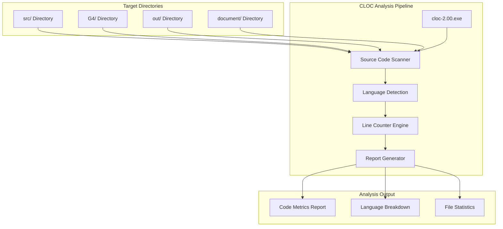
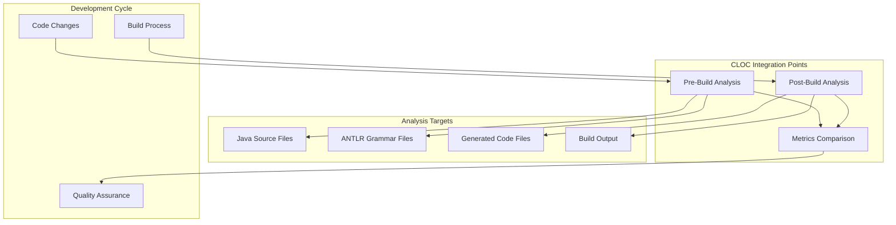
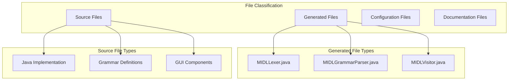

# Code Analysis Tools

> **Relevant source files**
> * [cloc-2.00.exe](https://github.com/yanzhe-Xiao/My-First-Complier-Work/blob/f0d8f425/cloc-2.00.exe)

This document covers the code analysis tools integrated into the MIDL Compiler project, specifically focusing on the `cloc-2.00.exe` code metrics tool and its role in the development workflow. For information about the compiler system itself, see [Compiler System](/yanzhe-Xiao/My-First-Complier-Work/2-compiler-system). For development environment setup, see [Development Environment](/yanzhe-Xiao/My-First-Complier-Work/3-development-environment).

## Overview

The MIDL Compiler project incorporates code analysis tools to provide quantitative metrics about the codebase, enabling developers to track code growth, complexity, and composition. The primary tool used is the CLOC (Count Lines of Code) utility, which generates detailed statistics about source code files across different programming languages.

## CLOC Code Metrics Tool

The project includes `cloc-2.00.exe`, a standalone executable that analyzes source code and generates comprehensive line count statistics. This tool operates independently of the main compiler pipeline and can be invoked to analyze various components of the project.

### Tool Architecture

Sources: cloc-2.00.exe (project root)

### Supported Analysis Types

| Analysis Type | Description | Target Files |
| --- | --- | --- |
| Java Source Analysis | Counts lines in Java source files | `*.java` files in `src/` |
| ANTLR Grammar Analysis | Analyzes grammar definition files | `*.g4` files in `G4/` |
| Documentation Analysis | Processes documentation files | `*.md` files in `document/` |
| Generated Code Analysis | Examines ANTLR-generated files | Generated `*.java` files |

### Integration with Development Workflow

Sources: cloc-2.00.exe (project root)

## Metrics Categories

The CLOC tool provides several categories of code metrics that are particularly relevant to the MIDL Compiler project:

### Source Code Metrics

* **Physical Lines**: Total number of lines in source files
* **Source Lines of Code (SLOC)**: Lines containing actual code statements
* **Comment Lines**: Lines containing comments and documentation
* **Blank Lines**: Empty lines used for formatting

### Language-Specific Analysis

| Language | File Extensions | Analysis Focus |
| --- | --- | --- |
| Java | `.java` | Main implementation code |
| ANTLR Grammar | `.g4` | Grammar definitions |
| Markdown | `.md` | Documentation content |
| XML | `.xml` | Configuration files |

### File Distribution Analysis

The tool categorizes files based on their role in the compiler system:

Sources: cloc-2.00.exe (project root)

## Usage Patterns

The CLOC tool can be executed in several modes depending on the analysis requirements:

### Directory Analysis Mode

Analyzes all files within specified directories, providing comprehensive project-wide metrics.

### Language-Specific Mode

Focuses analysis on specific programming languages, useful for understanding the composition of different components.

### Comparative Analysis Mode

Compares metrics between different versions or branches of the codebase to track development progress.

## Quality Assurance Integration

The code analysis tools serve as part of the overall quality assurance strategy for the MIDL Compiler project. The metrics generated help identify:

* Code complexity trends
* Documentation coverage
* Generated versus hand-written code ratios
* Project size and growth patterns

This quantitative data supports development decisions and helps maintain code quality standards throughout the project lifecycle.

Sources: cloc-2.00.exe (project root)