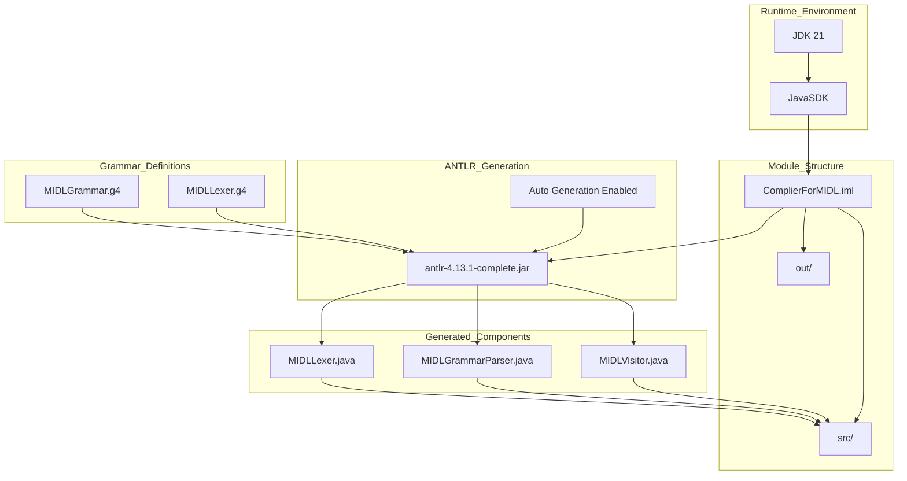
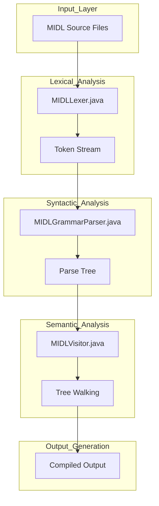
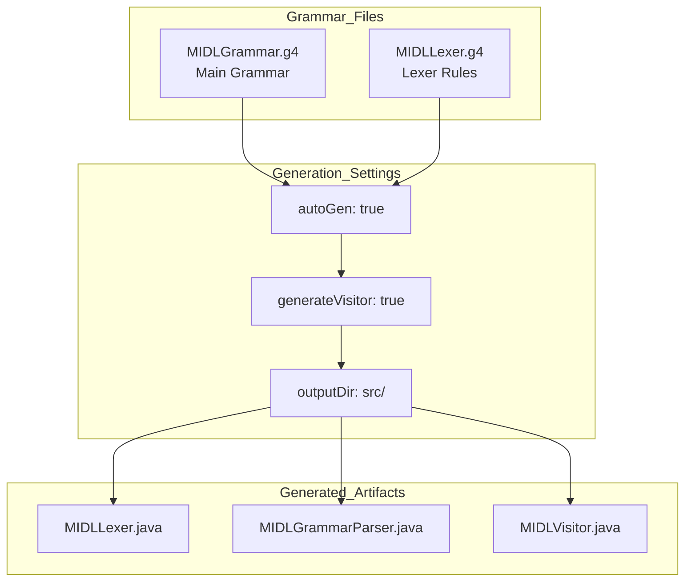

# Compiler System

> **Relevant source files**
> * [.idea/misc.xml](https://github.com/yanzhe-Xiao/My-First-Complier-Work/blob/f0d8f425/.idea/misc.xml)
> * [ComplierForMIDL.iml](https://github.com/yanzhe-Xiao/My-First-Complier-Work/blob/f0d8f425/ComplierForMIDL.iml)

## Purpose and Scope

This document covers the core MIDL compiler architecture, including the main module structure, ANTLR framework integration, and language processing pipeline. The compiler system implements a complete MIDL language processor using Java and ANTLR 4.13.1.

For detailed information about the IntelliJ IDEA development environment setup, see [IntelliJ IDEA Configuration](/yanzhe-Xiao/My-First-Complier-Work/3.1-intellij-idea-configuration). For build configuration specifics, see [Module Configuration](/yanzhe-Xiao/My-First-Complier-Work/2.1-module-configuration).

## Core Architecture

The MIDL compiler system is built around a modular Java architecture that leverages ANTLR for automated parser generation. The system consists of grammar definitions, generated language processing components, and a main compiler module.

### System Components Overview

**Sources:** [.idea/misc.xml L1-L32](https://github.com/yanzhe-Xiao/My-First-Complier-Work/blob/f0d8f425/.idea/misc.xml#L1-L32)

 [ComplierForMIDL.iml L1-L20](https://github.com/yanzhe-Xiao/My-First-Complier-Work/blob/f0d8f425/ComplierForMIDL.iml#L1-L20)

## Language Processing Pipeline

The compiler implements a traditional three-phase language processing pipeline using ANTLR-generated components. Each phase corresponds to a specific generated Java class that handles lexical analysis, syntactic analysis, and semantic processing.

### ANTLR Processing Flow

**Sources:** [.idea/misc.xml L7-L25](https://github.com/yanzhe-Xiao/My-First-Complier-Work/blob/f0d8f425/.idea/misc.xml#L7-L25)

## Module Configuration

The `ComplierForMIDL` module defines the core structure and dependencies for the compiler system. The module uses the standard Java module format with specific ANTLR library integration.

### Module Dependencies and Structure

| Component | Configuration | Value |
| --- | --- | --- |
| Module Type | `JAVA_MODULE` | Standard Java module |
| Source Directory | `sourceFolder` | `$MODULE_DIR$/src` |
| Output Directory | `output` | `$PROJECT_DIR$/out` |
| JDK Version | `languageLevel` | `JDK_21` |
| ANTLR Library | `module-library` | `antlr-4.13.1-complete.jar` |

The module configuration specifies that generated ANTLR components are placed directly in the `src` folder alongside custom Java source code.

**Sources:** [ComplierForMIDL.iml L2-L19](https://github.com/yanzhe-Xiao/My-First-Complier-Work/blob/f0d8f425/ComplierForMIDL.iml#L2-L19)

 [.idea/misc.xml L29-L31](https://github.com/yanzhe-Xiao/My-First-Complier-Work/blob/f0d8f425/.idea/misc.xml#L29-L31)

## ANTLR Generation Configuration

The ANTLR integration is configured through IntelliJ IDEA's ANTLR plugin with specific generation preferences for both grammar files. The system uses automatic generation with visitor pattern support.

### Grammar File Configuration

Both grammar files (`MIDLGrammar.g4` and `MIDLLexer.g4`) are configured with identical generation settings: automatic generation enabled, visitor pattern generation enabled, and output directed to the `src` directory.

**Sources:** [.idea/misc.xml L3-L28](https://github.com/yanzhe-Xiao/My-First-Complier-Work/blob/f0d8f425/.idea/misc.xml#L3-L28)