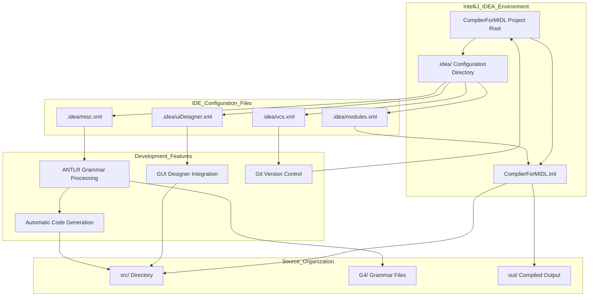
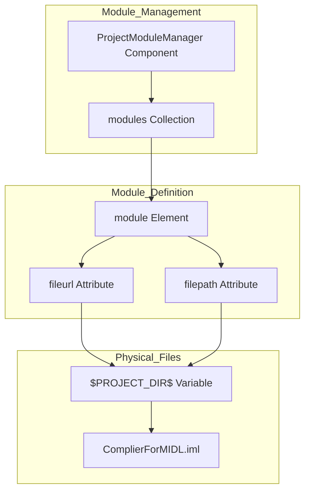

# Development Environment

> **Relevant source files**
> * [.idea/modules.xml](https://github.com/yanzhe-Xiao/My-First-Complier-Work/blob/f0d8f425/.idea/modules.xml)
> * [.idea/vcs.xml](https://github.com/yanzhe-Xiao/My-First-Complier-Work/blob/f0d8f425/.idea/vcs.xml)

## Purpose and Scope

This document describes the development environment configuration for the MIDL Compiler project, including IDE setup, project structure, and development workflow integration. The development environment is built around IntelliJ IDEA with specific configurations for ANTLR grammar processing, Java compilation, and version control integration.

For detailed IDE configuration settings, see [IntelliJ IDEA Configuration](/yanzhe-Xiao/My-First-Complier-Work/3.1-intellij-idea-configuration). For version control setup and Git configuration, see [Version Control Setup](/yanzhe-Xiao/My-First-Complier-Work/3.2-version-control-setup). For information about the core compiler architecture, see [Compiler System](/yanzhe-Xiao/My-First-Complier-Work/2-compiler-system).

## Development Environment Overview

The MIDL Compiler project uses IntelliJ IDEA as the primary development environment, configured specifically for Java-based compiler development with ANTLR integration. The environment supports automatic code generation from grammar files, Swing GUI development, and integrated version control.

## IDE Integration Architecture

The following diagram shows how the IntelliJ IDEA development environment integrates with the project structure and build processes:

**Sources:** [.idea/modules.xml L1-L8](https://github.com/yanzhe-Xiao/My-First-Complier-Work/blob/f0d8f425/.idea/modules.xml#L1-L8)

 [.idea/vcs.xml L1-L6](https://github.com/yanzhe-Xiao/My-First-Complier-Work/blob/f0d8f425/.idea/vcs.xml#L1-L6)

## Project Module Configuration

The development environment centers around the `ComplierForMIDL` module, which is registered in the IDE's module management system. The module configuration defines the project structure and build dependencies.

The module registration follows this configuration pattern:

* **Component**: `ProjectModuleManager` manages all project modules
* **Module Reference**: Points to `ComplierForMIDL.iml` using `$PROJECT_DIR$` variable
* **Dual Addressing**: Both `fileurl` and `filepath` attributes reference the same module file

**Sources:** [.idea/modules.xml L3-L7](https://github.com/yanzhe-Xiao/My-First-Complier-Work/blob/f0d8f425/.idea/modules.xml#L3-L7)

## Version Control Integration

The development environment includes Git integration configured through the VCS component. This enables seamless version control operations directly within the IDE.

| Configuration Component | Purpose | Target Directory |
| --- | --- | --- |
| `VcsDirectoryMappings` | Maps project directories to VCS systems | Root project directory |
| `mapping` element | Defines VCS type and directory scope | `$PROJECT_DIR$` with Git |

The VCS configuration establishes:

* **Directory Mapping**: `$PROJECT_DIR$` mapped to Git version control
* **VCS Type**: Git specified as the version control system
* **Scope**: Entire project directory tree under version control

**Sources:** [.idea/vcs.xml L3-L5](https://github.com/yanzhe-Xiao/My-First-Complier-Work/blob/f0d8f425/.idea/vcs.xml#L3-L5)

## Development Workflow Integration

The development environment supports the complete compiler development workflow through integrated tooling and automatic processes. The IDE configuration enables:

* **ANTLR Grammar Processing**: Automatic generation of lexer and parser components from `.g4` files
* **Java Compilation**: Standard Java build process with JDK 21 compatibility
* **GUI Development**: Swing components with visual designer support
* **Version Control**: Git integration for source code management
* **Code Generation**: Automatic creation of ANTLR-generated source files

This integrated environment streamlines the development process by automating repetitive tasks and providing seamless tool integration within a single IDE workspace.

**Sources:** [.idea/modules.xml L1-L8](https://github.com/yanzhe-Xiao/My-First-Complier-Work/blob/f0d8f425/.idea/modules.xml#L1-L8)

 [.idea/vcs.xml L1-L6](https://github.com/yanzhe-Xiao/My-First-Complier-Work/blob/f0d8f425/.idea/vcs.xml#L1-L6)