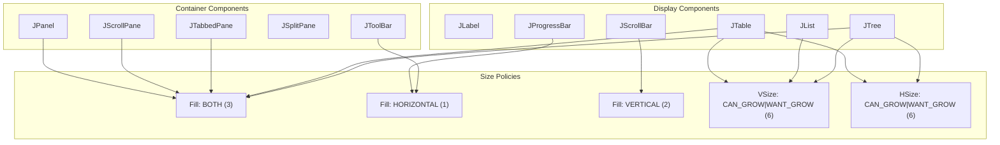

# GUI Components

> **Relevant source files**
> * [.idea/uiDesigner.xml](https://github.com/yanzhe-Xiao/My-First-Complier-Work/blob/f0d8f425/.idea/uiDesigner.xml)

This document covers the Swing-based graphical user interface components available for the MIDL compiler system. It details the UI Designer configuration, component palette setup, and default constraints for building the compiler's user interface within IntelliJ IDEA.

For information about the overall module configuration and dependencies, see [Module Configuration](/yanzhe-Xiao/My-First-Complier-Work/2.1-module-configuration). For details about the IntelliJ IDEA development environment setup, see [IntelliJ IDEA Configuration](/yanzhe-Xiao/My-First-Complier-Work/3.1-intellij-idea-configuration).

## UI Designer Configuration

The MIDL compiler project utilizes IntelliJ IDEA's built-in GUI Designer for creating Swing-based user interfaces. The UI Designer configuration is defined in [.idea/uiDesigner.xml L1-L124](https://github.com/yanzhe-Xiao/My-First-Complier-Work/blob/f0d8f425/.idea/uiDesigner.xml#L1-L124)

 which establishes the component palette and default settings for GUI development.

The configuration defines a `Palette2` component within the project structure, containing a comprehensive set of Swing components organized under a single "Swing" group. This palette provides developers with immediate access to standard Java Swing components when designing the compiler's user interface.

**Sources:** [.idea/uiDesigner.xml L1-L124](https://github.com/yanzhe-Xiao/My-First-Complier-Work/blob/f0d8f425/.idea/uiDesigner.xml#L1-L124)

## Component Palette Architecture

```mermaid
flowchart TD

LAYOUT["Layout Components"]
INPUT["Input Components"]
DISPLAY["Display Components"]
CONTAINER["Container Components"]
CONTROL["Control Components"]
HSpacer["HSpacer"]
VSpacer["VSpacer"]
JSeparator["JSeparator"]
JTextField["JTextField"]
JPasswordField["JPasswordField"]
JFormattedTextField["JFormattedTextField"]
JTextArea["JTextArea"]
JSpinner["JSpinner"]
JSlider["JSlider"]
JLabel["JLabel"]
JProgressBar["JProgressBar"]
JPanel["JPanel"]
JScrollPane["JScrollPane"]
JTabbedPane["JTabbedPane"]
JSplitPane["JSplitPane"]
JToolBar["JToolBar"]
JButton["JButton"]
JRadioButton["JRadioButton"]
JCheckBox["JCheckBox"]
JComboBox["JComboBox"]
JTable["JTable"]
JList["JList"]
JTree["JTree"]

LAYOUT --> HSpacer
LAYOUT --> VSpacer
LAYOUT --> JSeparator
INPUT --> JTextField
INPUT --> JPasswordField
INPUT --> JFormattedTextField
INPUT --> JTextArea
INPUT --> JSpinner
INPUT --> JSlider
DISPLAY --> JLabel
DISPLAY --> JProgressBar
CONTAINER --> JPanel
CONTAINER --> JScrollPane
CONTAINER --> JTabbedPane
CONTAINER --> JSplitPane
CONTAINER --> JToolBar
CONTROL --> JButton
CONTROL --> JRadioButton
CONTROL --> JCheckBox
CONTROL --> JComboBox
CONTROL --> JTable
CONTROL --> JList
CONTROL --> JTree

subgraph Palette2_Component ["Palette2 Component"]

subgraph Swing_Group ["Swing Group"]
    LAYOUT
    INPUT
    DISPLAY
    CONTAINER
    CONTROL
end
end
```

**Sources:** [.idea/uiDesigner.xml L3-L122](https://github.com/yanzhe-Xiao/My-First-Complier-Work/blob/f0d8f425/.idea/uiDesigner.xml#L3-L122)

## Available Swing Components

The UI Designer palette includes a comprehensive set of `javax.swing` components, each configured with specific default constraints and properties:

### Layout and Spacing Components

| Component | Class | Purpose | Default Size Policy |
| --- | --- | --- | --- |
| Horizontal Spacer | `com.intellij.uiDesigner.HSpacer` | Horizontal layout spacing | H:6, V:1 |
| Vertical Spacer | `com.intellij.uiDesigner.VSpacer` | Vertical layout spacing | H:1, V:6 |
| Separator | `javax.swing.JSeparator` | Visual element separation | H:6, V:6 |

### Input Components

| Component | Class | Auto-Binding | Default Width |
| --- | --- | --- | --- |
| Text Field | `javax.swing.JTextField` | Yes | 150px |
| Password Field | `javax.swing.JPasswordField` | Yes | 150px |
| Formatted Text Field | `javax.swing.JFormattedTextField` | Yes | 150px |
| Text Area | `javax.swing.JTextArea` | Yes | 150px × 50px |
| Text Pane | `javax.swing.JTextPane` | Yes | 150px × 50px |
| Editor Pane | `javax.swing.JEditorPane` | Yes | 150px × 50px |

### Control Components

| Component | Class | Auto-Binding | Initial Text |
| --- | --- | --- | --- |
| Button | `javax.swing.JButton` | Yes | "Button" |
| Radio Button | `javax.swing.JRadioButton` | Yes | "RadioButton" |
| Check Box | `javax.swing.JCheckBox` | Yes | "CheckBox" |
| Combo Box | `javax.swing.JComboBox` | Yes | - |
| Spinner | `javax.swing.JSpinner` | Yes | - |
| Slider | `javax.swing.JSlider` | Yes | - |

**Sources:** [.idea/uiDesigner.xml L5-L104](https://github.com/yanzhe-Xiao/My-First-Complier-Work/blob/f0d8f425/.idea/uiDesigner.xml#L5-L104)

## Container and Display Components

### Container Components Configuration

* **JPanel** [.idea/uiDesigner.xml L11-L13](https://github.com/yanzhe-Xiao/My-First-Complier-Work/blob/f0d8f425/.idea/uiDesigner.xml#L11-L13) : Basic container with `vsize-policy="3"` and `hsize-policy="3"`
* **JScrollPane** [.idea/uiDesigner.xml L14-L16](https://github.com/yanzhe-Xiao/My-First-Complier-Work/blob/f0d8f425/.idea/uiDesigner.xml#L14-L16) : Scrollable container with `vsize-policy="7"` and `hsize-policy="7"`
* **JTabbedPane** [.idea/uiDesigner.xml L89-L93](https://github.com/yanzhe-Xiao/My-First-Complier-Work/blob/f0d8f425/.idea/uiDesigner.xml#L89-L93) : Tabbed interface with preferred size 200×200px
* **JSplitPane** [.idea/uiDesigner.xml L94-L98](https://github.com/yanzhe-Xiao/My-First-Complier-Work/blob/f0d8f425/.idea/uiDesigner.xml#L94-L98) : Resizable split container with preferred size 200×200px
* **JToolBar** [.idea/uiDesigner.xml L111-L115](https://github.com/yanzhe-Xiao/My-First-Complier-Work/blob/f0d8f425/.idea/uiDesigner.xml#L111-L115) : Toolbar container with preferred height of 20px

### Display Components Configuration

* **JLabel** [.idea/uiDesigner.xml L35-L40](https://github.com/yanzhe-Xiao/My-First-Complier-Work/blob/f0d8f425/.idea/uiDesigner.xml#L35-L40) : Text/icon display with default text "Label"
* **JTable** [.idea/uiDesigner.xml L74-L78](https://github.com/yanzhe-Xiao/My-First-Complier-Work/blob/f0d8f425/.idea/uiDesigner.xml#L74-L78) : Tabular data display with 150×50px preferred size
* **JList** [.idea/uiDesigner.xml L79-L83](https://github.com/yanzhe-Xiao/My-First-Complier-Work/blob/f0d8f425/.idea/uiDesigner.xml#L79-L83) : List display with `hsize-policy="2"`
* **JTree** [.idea/uiDesigner.xml L84-L88](https://github.com/yanzhe-Xiao/My-First-Complier-Work/blob/f0d8f425/.idea/uiDesigner.xml#L84-L88) : Hierarchical data display with 150×50px preferred size
* **JProgressBar** [.idea/uiDesigner.xml L108-L110](https://github.com/yanzhe-Xiao/My-First-Complier-Work/blob/f0d8f425/.idea/uiDesigner.xml#L108-L110) : Progress indication with `fill="1"`

**Sources:** [.idea/uiDesigner.xml L11-L121](https://github.com/yanzhe-Xiao/My-First-Complier-Work/blob/f0d8f425/.idea/uiDesigner.xml#L11-L121)

## Size Policy and Constraint System

The UI Designer uses a numeric size policy system to define component behavior:

| Policy Value | Meaning | Components Using |
| --- | --- | --- |
| 0 | Fixed size | `JButton`, `JLabel`, `JRadioButton` |
| 1 | Grow vertically | `HSpacer` |
| 2 | Shrink horizontally | `JComboBox`, `JList` |
| 3 | Both grow/shrink | `JPanel`, `JTabbedPane` |
| 6 | Can grow + want grow | `JTextField`, `JTextArea`, `VSpacer` |
| 7 | Full resize capability | `JScrollPane` |

### Anchor and Fill Constraints

* **Anchor "0"**: Center alignment (used by most containers)
* **Anchor "8"**: Northwest alignment (used by input components)
* **Fill "0"**: No fill (buttons, checkboxes)
* **Fill "1"**: Horizontal fill (text fields, progress bars)
* **Fill "2"**: Vertical fill (scroll bars)
* **Fill "3"**: Both directions fill (containers, text areas)

**Sources:** [.idea/uiDesigner.xml L6-L121](https://github.com/yanzhe-Xiao/My-First-Complier-Work/blob/f0d8f425/.idea/uiDesigner.xml#L6-L121)

## Integration with Compiler Interface

The configured Swing components provide the foundation for building the MIDL compiler's user interface. The palette enables developers to create forms for:

* Source code input areas using `JTextArea` and `JEditorPane`
* Compilation controls using `JButton` and `JProgressBar`
* Results display using `JTable`, `JTree`, or `JList`
* Configuration panels using `JTabbedPane` and form components
* Status information using `JLabel` and `JToolBar`

The auto-binding configuration [.idea/uiDesigner.xml L17-L119](https://github.com/yanzhe-Xiao/My-First-Complier-Work/blob/f0d8f425/.idea/uiDesigner.xml#L17-L119)

 ensures that interactive components can be easily connected to the compiler's business logic.

**Sources:** [.idea/uiDesigner.xml L1-L124](https://github.com/yanzhe-Xiao/My-First-Complier-Work/blob/f0d8f425/.idea/uiDesigner.xml#L1-L124)