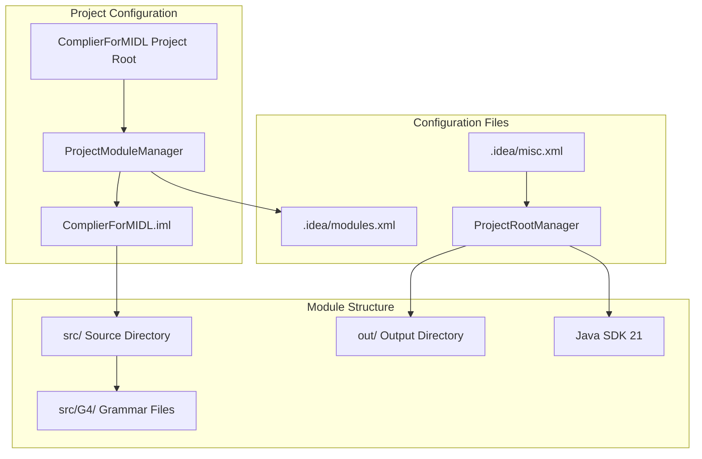
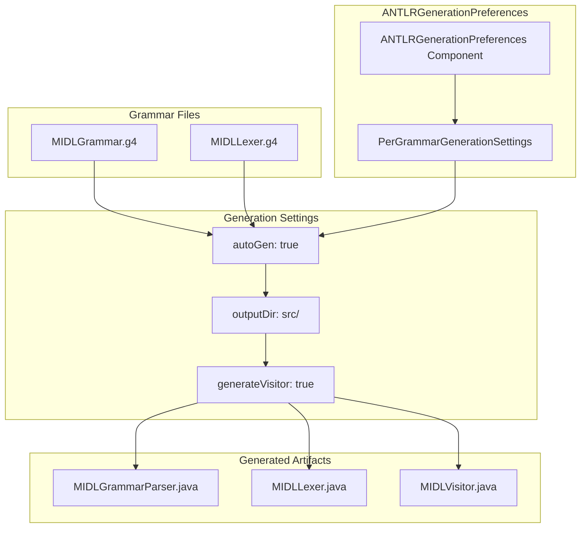
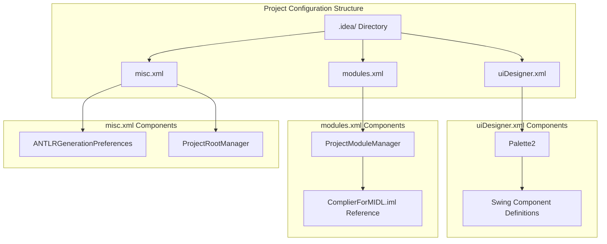

# IntelliJ IDEA Configuration

> **Relevant source files**
> * [.idea/misc.xml](https://github.com/yanzhe-Xiao/My-First-Complier-Work/blob/f0d8f425/.idea/misc.xml)
> * [.idea/modules.xml](https://github.com/yanzhe-Xiao/My-First-Complier-Work/blob/f0d8f425/.idea/modules.xml)
> * [.idea/uiDesigner.xml](https://github.com/yanzhe-Xiao/My-First-Complier-Work/blob/f0d8f425/.idea/uiDesigner.xml)

## Purpose and Scope

This document details the IntelliJ IDEA IDE configuration for the MIDL Compiler project, covering project structure setup, ANTLR integration, and development environment settings. The configuration enables automatic code generation from grammar files, GUI development with Swing components, and proper Java development workflow.

For information about the core compiler module setup, see [Module Configuration](/yanzhe-Xiao/My-First-Complier-Work/2.1-module-configuration). For details about GUI component implementation, see [GUI Components](/yanzhe-Xiao/My-First-Complier-Work/2.3-gui-components).

## Project Structure and Module Management

The IntelliJ IDEA project is configured as a single-module Java application with specific settings for ANTLR integration and Swing GUI development.

### Module Configuration Overview

The project uses a single module configuration defined in [ComplierForMIDL.iml](https://github.com/yanzhe-Xiao/My-First-Complier-Work/blob/f0d8f425/ComplierForMIDL.iml)

 and registered through the `ProjectModuleManager` component. The module structure points to standard Java project directories with special handling for ANTLR grammar files in the `G4` subdirectory.

**Sources:** [.idea/modules.xml L1-L8](https://github.com/yanzhe-Xiao/My-First-Complier-Work/blob/f0d8f425/.idea/modules.xml#L1-L8)

 [.idea/misc.xml L29-L31](https://github.com/yanzhe-Xiao/My-First-Complier-Work/blob/f0d8f425/.idea/misc.xml#L29-L31)

### Java SDK and Output Configuration

The project is configured to use Java Development Kit version 21 as the primary language level. The build output is directed to the `out/` directory at the project root.

| Configuration Component | Setting | Value |
| --- | --- | --- |
| `ProjectRootManager` | `languageLevel` | `JDK_21` |
| `ProjectRootManager` | `project-jdk-name` | `21` |
| `ProjectRootManager` | `project-jdk-type` | `JavaSDK` |
| `ProjectRootManager` | `output url` | `file://$PROJECT_DIR$/out` |

**Sources:** [.idea/misc.xml L29-L31](https://github.com/yanzhe-Xiao/My-First-Complier-Work/blob/f0d8f425/.idea/misc.xml#L29-L31)

## ANTLR Integration and Code Generation

The IDE is configured with comprehensive ANTLR support for automatic code generation from grammar files. This configuration enables seamless development of the lexer and parser components.

### ANTLR Generation Settings

The ANTLR integration uses the `ANTLRGenerationPreferences` component with individual `PerGrammarGenerationSettings` for each grammar file. Both grammar files are configured with identical generation parameters for consistency.

**Sources:** [.idea/misc.xml L3-L28](https://github.com/yanzhe-Xiao/My-First-Complier-Work/blob/f0d8f425/.idea/misc.xml#L3-L28)

### Per-Grammar Configuration Details

The ANTLR configuration includes two grammar file configurations:

**MIDLGrammar.g4 Configuration:**

* File path: `$PROJECT_DIR$/src/G4/MIDLGrammar.g4`
* Auto-generation: Enabled
* Output directory: `C:\Code\IdeaProjects\ComplierForMIDL\src`
* Visitor generation: Enabled

**MIDLLexer.g4 Configuration:**

* File path: `$PROJECT_DIR$/src/G4/MIDLLexer.g4`
* Auto-generation: Enabled
* Output directory: `C:\Code\IdeaProjects\ComplierForMIDL\src`
* Visitor generation: Enabled

Both configurations use empty values for `libDir`, `encoding`, `pkg`, and `language` parameters, relying on ANTLR defaults.

**Sources:** [.idea/misc.xml L6-L25](https://github.com/yanzhe-Xiao/My-First-Complier-Work/blob/f0d8f425/.idea/misc.xml#L6-L25)

## GUI Designer Configuration

The IDE includes comprehensive Swing GUI designer support through the `uiDesigner.xml` configuration. This enables visual development of the compiler's user interface components.

### Swing Component Palette Configuration

```mermaid
flowchart TD

SWING_GROUP["Swing Group"]
UI_DESIGNER["uiDesigner.xml"]
HSPACER["HSpacer"]
VSPACER["VSpacer"]
JPANEL["JPanel"]
JSCROLLPANE["JScrollPane"]
JBUTTON["JButton"]
JRADIOBUTTON["JRadioButton"]
JCHECKBOX["JCheckBox"]
JTEXTFIELD["JTextField"]
JPASSWORDFIELD["JPasswordField"]
JLABEL["JLabel"]
JTEXTAREA["JTextArea"]
JTEXTPANE["JTextPane"]
JEDITORPANE["JEditorPane"]
JTABLE["JTable"]
JCOMBOBOX["JComboBox"]
JLIST["JList"]
JTREE["JTree"]
JTABBEDPANE["JTabbedPane"]
JSPLITPANE["JSplitPane"]

SWING_GROUP --> HSPACER
SWING_GROUP --> VSPACER
SWING_GROUP --> JPANEL
SWING_GROUP --> JSCROLLPANE
SWING_GROUP --> JBUTTON
SWING_GROUP --> JRADIOBUTTON
SWING_GROUP --> JCHECKBOX
SWING_GROUP --> JTEXTFIELD
SWING_GROUP --> JPASSWORDFIELD
SWING_GROUP --> JLABEL
SWING_GROUP --> JTEXTAREA
SWING_GROUP --> JTEXTPANE
SWING_GROUP --> JEDITORPANE
SWING_GROUP --> JTABLE
SWING_GROUP --> JCOMBOBOX
SWING_GROUP --> JLIST
SWING_GROUP --> JTREE
SWING_GROUP --> JTABBEDPANE
SWING_GROUP --> JSPLITPANE

subgraph subGraph4 ["Container Components"]
    JCOMBOBOX
    JLIST
    JTREE
    JTABBEDPANE
    JSPLITPANE
end

subgraph subGraph3 ["Display Components"]
    JLABEL
    JTEXTAREA
    JTEXTPANE
    JEDITORPANE
    JTABLE
end

subgraph subGraph2 ["Input Components"]
    JBUTTON
    JRADIOBUTTON
    JCHECKBOX
    JTEXTFIELD
    JPASSWORDFIELD
end

subgraph subGraph1 ["Layout Components"]
    HSPACER
    VSPACER
    JPANEL
    JSCROLLPANE
end

subgraph subGraph0 ["Palette2 Component"]
    SWING_GROUP
    UI_DESIGNER
    UI_DESIGNER --> SWING_GROUP
end
```

The GUI designer palette includes a comprehensive set of standard Swing components organized in a single "Swing" group. Each component includes default constraints for automatic layout management.

**Sources:** [.idea/uiDesigner.xml L3-L123](https://github.com/yanzhe-Xiao/My-First-Complier-Work/blob/f0d8f425/.idea/uiDesigner.xml#L3-L123)

### Component Default Constraints

The GUI designer configuration specifies default layout constraints for each Swing component type. Key component categories include:

| Component Category | Examples | Default Sizing Policy |
| --- | --- | --- |
| Spacer Components | `HSpacer`, `VSpacer` | Flexible sizing (policy 6) |
| Container Components | `JPanel`, `JScrollPane` | Expandable (policy 3,7) |
| Input Components | `JTextField`, `JButton` | Fixed height, flexible width |
| Display Components | `JLabel`, `JTextArea` | Context-dependent sizing |

All components include specific `vsize-policy`, `hsize-policy`, `anchor`, and `fill` settings to ensure consistent layout behavior in the GUI designer.

**Sources:** [.idea/uiDesigner.xml L5-L121](https://github.com/yanzhe-Xiao/My-First-Complier-Work/blob/f0d8f425/.idea/uiDesigner.xml#L5-L121)

## Configuration File Structure

The IntelliJ IDEA configuration is organized across three primary XML configuration files in the `.idea/` directory:

### Configuration Components Overview

Each configuration file serves a distinct purpose in the IDE setup: `misc.xml` handles project-wide settings and ANTLR integration, `modules.xml` manages module structure, and `uiDesigner.xml` configures GUI development tools.

**Sources:** [.idea/misc.xml L1-L32](https://github.com/yanzhe-Xiao/My-First-Complier-Work/blob/f0d8f425/.idea/misc.xml#L1-L32)

 [.idea/modules.xml L1-L8](https://github.com/yanzhe-Xiao/My-First-Complier-Work/blob/f0d8f425/.idea/modules.xml#L1-L8)

 [.idea/uiDesigner.xml L1-L124](https://github.com/yanzhe-Xiao/My-First-Complier-Work/blob/f0d8f425/.idea/uiDesigner.xml#L1-L124)