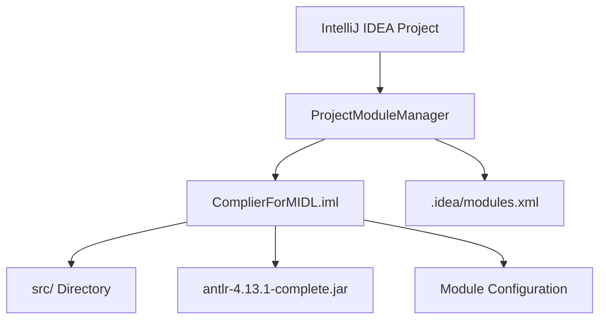
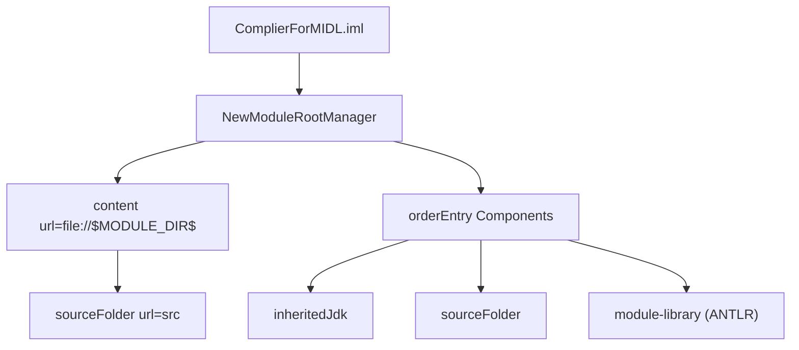
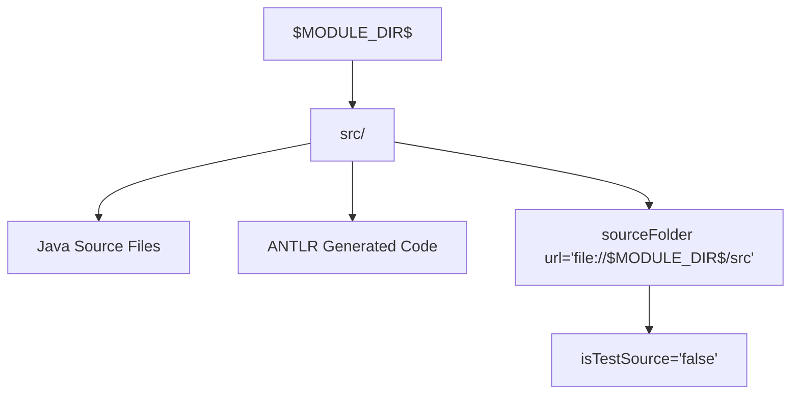
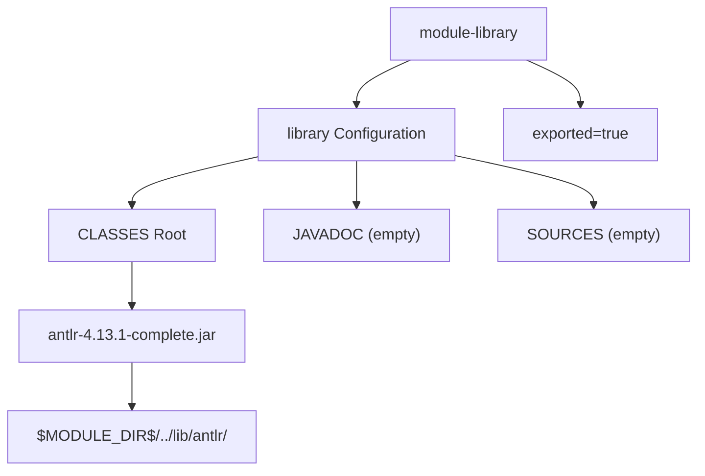

# Module Configuration

> **Relevant source files**
> * [.idea/modules.xml](https://github.com/yanzhe-Xiao/My-First-Complier-Work/blob/f0d8f425/.idea/modules.xml)
> * [ComplierForMIDL.iml](https://github.com/yanzhe-Xiao/My-First-Complier-Work/blob/f0d8f425/ComplierForMIDL.iml)

This document details the main `ComplierForMIDL` module setup, including its dependency configuration, source folder structure, and ANTLR library integration. The module configuration defines how the compiler project is organized within the IntelliJ IDEA development environment and specifies the external dependencies required for compilation.

For information about ANTLR framework integration and grammar processing, see [ANTLR Integration](/yanzhe-Xiao/My-First-Complier-Work/2.2-antlr-integration). For details about the IntelliJ IDEA project-level settings, see [IntelliJ IDEA Configuration](/yanzhe-Xiao/My-First-Complier-Work/3.1-intellij-idea-configuration).

## Module Structure Overview

The MIDL compiler project is configured as a single Java module named `ComplierForMIDL` within the IntelliJ IDEA project structure. The module follows standard Java project conventions with a dedicated source directory and external library dependencies.

### Module Hierarchy

Sources: [.idea/modules.xml L1-L8](https://github.com/yanzhe-Xiao/My-First-Complier-Work/blob/f0d8f425/.idea/modules.xml#L1-L8)

 [ComplierForMIDL.iml L1-L20](https://github.com/yanzhe-Xiao/My-First-Complier-Work/blob/f0d8f425/ComplierForMIDL.iml#L1-L20)

## Module Definition File

The primary module configuration is defined in `ComplierForMIDL.iml`, which specifies the module type, compilation settings, and dependencies. This file serves as the central configuration point for the module's build and runtime environment.

### Core Module Properties

| Property | Value | Description |
| --- | --- | --- |
| Module Type | `JAVA_MODULE` | Standard Java module configuration |
| Version | `4` | IntelliJ module format version |
| Compiler Output | `inherit-compiler-output="true"` | Uses project-level output settings |
| Source Folder | `src` | Main source code directory |

### Module Configuration Structure

Sources: [ComplierForMIDL.iml L2-L19](https://github.com/yanzhe-Xiao/My-First-Complier-Work/blob/f0d8f425/ComplierForMIDL.iml#L2-L19)

## Source Folder Configuration

The module defines a single source folder structure that organizes the Java source code and generated ANTLR components.

### Source Directory Setup

The source folder configuration specifies `src` as the primary source directory [ComplierForMIDL.iml L6](https://github.com/yanzhe-Xiao/My-First-Complier-Work/blob/f0d8f425/ComplierForMIDL.iml#L6-L6)

 This directory contains:

* Custom Java implementation code
* ANTLR-generated lexer and parser classes
* GUI components and related utilities

Sources: [ComplierForMIDL.iml L5-L7](https://github.com/yanzhe-Xiao/My-First-Complier-Work/blob/f0d8f425/ComplierForMIDL.iml#L5-L7)

## Dependency Configuration

The module's dependency configuration includes both standard Java runtime components and the external ANTLR library required for parser generation and language processing.

### Dependency Order Entries

The module defines three primary dependency types in its classpath order:

1. **Inherited JDK** - Standard Java runtime libraries [ComplierForMIDL.iml L8](https://github.com/yanzhe-Xiao/My-First-Complier-Work/blob/f0d8f425/ComplierForMIDL.iml#L8-L8)
2. **Source Folder** - Project source code access [ComplierForMIDL.iml L9](https://github.com/yanzhe-Xiao/My-First-Complier-Work/blob/f0d8f425/ComplierForMIDL.iml#L9-L9)
3. **ANTLR Library** - External parser generation framework [ComplierForMIDL.iml L10-L18](https://github.com/yanzhe-Xiao/My-First-Complier-Work/blob/f0d8f425/ComplierForMIDL.iml#L10-L18)

### ANTLR Library Integration

The ANTLR dependency is configured as an exported module library, allowing other components to access ANTLR classes during compilation and runtime.

Sources: [ComplierForMIDL.iml L10-L18](https://github.com/yanzhe-Xiao/My-First-Complier-Work/blob/f0d8f425/ComplierForMIDL.iml#L10-L18)

## Project Module Registration

The module is registered within the IntelliJ IDEA project through the `ProjectModuleManager` component, which maintains the list of all modules in the project workspace.

### Module Manager Configuration

The project's module management configuration references the `ComplierForMIDL.iml` file as the sole module definition [.idea/modules.xml L5](https://github.com/yanzhe-Xiao/My-First-Complier-Work/blob/f0d8f425/.idea/modules.xml#L5-L5)

 This establishes the module as the primary component of the compiler project.

| Configuration Element | Value |
| --- | --- |
| File URL | `file://$PROJECT_DIR$/ComplierForMIDL.iml` |
| File Path | `$PROJECT_DIR$/ComplierForMIDL.iml` |
| Module Count | 1 (single module project) |

Sources: [.idea/modules.xml L3-L7](https://github.com/yanzhe-Xiao/My-First-Complier-Work/blob/f0d8f425/.idea/modules.xml#L3-L7)

## Build and Compilation Settings

The module inherits compiler output settings from the project level, ensuring consistent build artifact placement across the development environment. The `inherit-compiler-output="true"` setting delegates output directory management to the project configuration [ComplierForMIDL.iml L3](https://github.com/yanzhe-Xiao/My-First-Complier-Work/blob/f0d8f425/ComplierForMIDL.iml#L3-L3)

This configuration approach centralizes build output management while allowing the module to focus on source organization and dependency specification.

Sources: [ComplierForMIDL.iml L3-L4](https://github.com/yanzhe-Xiao/My-First-Complier-Work/blob/f0d8f425/ComplierForMIDL.iml#L3-L4)