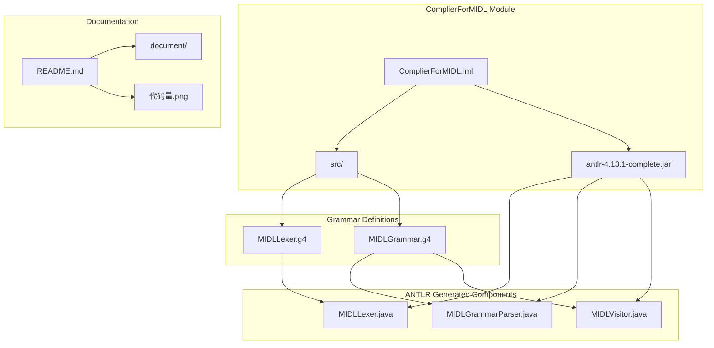
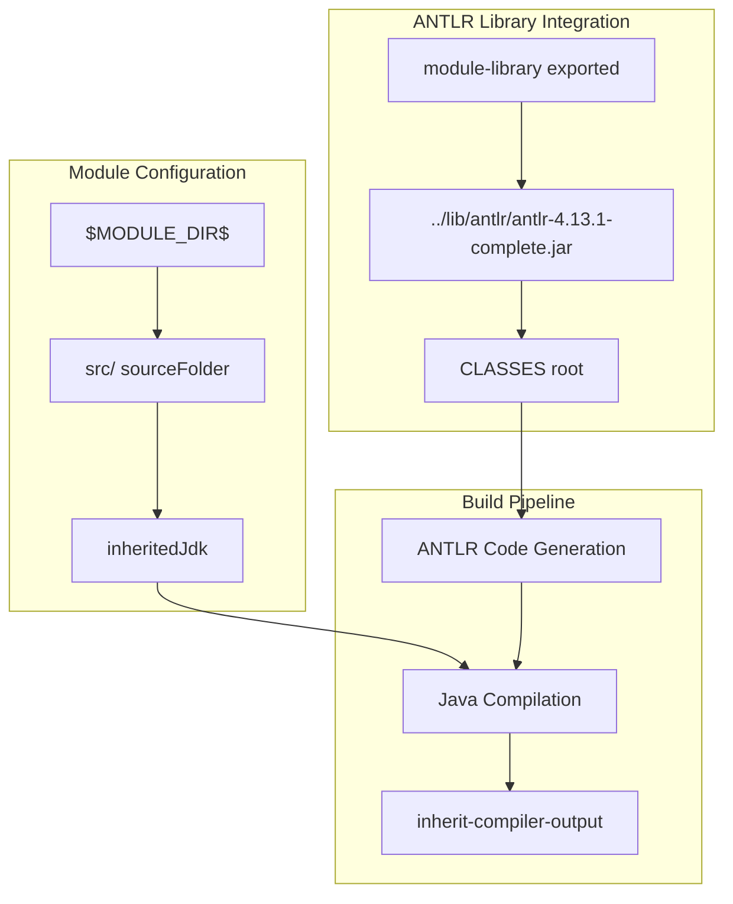
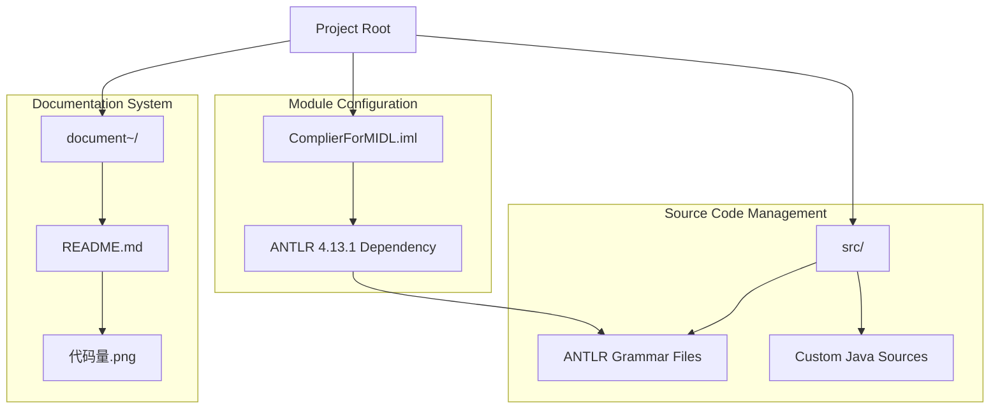

# Overview

> **Relevant source files**
> * [ComplierForMIDL.iml](https://github.com/yanzhe-Xiao/My-First-Complier-Work/blob/f0d8f425/ComplierForMIDL.iml)
> * [README.md](https://github.com/yanzhe-Xiao/My-First-Complier-Work/blob/f0d8f425/README.md)

This document provides a comprehensive overview of the MIDL Compiler project, an experimental compiler implementation built using Java and the ANTLR parser generator framework. The project demonstrates modern compiler construction techniques through a structured development environment and automated code generation pipeline.

For detailed information about the core compiler system architecture, see [Compiler System](/yanzhe-Xiao/My-First-Complier-Work/2-compiler-system). For development environment configuration details, see [Development Environment](/yanzhe-Xiao/My-First-Complier-Work/3-development-environment). For supporting tools and utilities, see [Tools and Utilities](/yanzhe-Xiao/My-First-Complier-Work/4-tools-and-utilities).

## Project Purpose and Architecture

The MIDL Compiler serves as an experimental implementation for processing MIDL (Interface Definition Language) source code through a complete compilation pipeline. The system leverages ANTLR 4.13.1 for automatic generation of lexical analyzers, parsers, and syntax tree visitors.

### System Architecture

*Sources: [ComplierForMIDL.iml L1-L20](https://github.com/yanzhe-Xiao/My-First-Complier-Work/blob/f0d8f425/ComplierForMIDL.iml#L1-L20)

 [README.md L1-L5](https://github.com/yanzhe-Xiao/My-First-Complier-Work/blob/f0d8f425/README.md#L1-L5)*

### Component Dependencies and Build Configuration

*Sources: [ComplierForMIDL.iml L3-L19](https://github.com/yanzhe-Xiao/My-First-Complier-Work/blob/f0d8f425/ComplierForMIDL.iml#L3-L19)*

## Technology Stack

The project utilizes the following core technologies and frameworks:

| Component | Version/Type | Purpose | Configuration Location |
| --- | --- | --- | --- |
| `ANTLR` | 4.13.1-complete | Parser generation and lexical analysis | [ComplierForMIDL.iml L13](https://github.com/yanzhe-Xiao/My-First-Complier-Work/blob/f0d8f425/ComplierForMIDL.iml#L13-L13) |
| `Java Module` | JAVA_MODULE version 4 | Core application framework | [ComplierForMIDL.iml L2](https://github.com/yanzhe-Xiao/My-First-Complier-Work/blob/f0d8f425/ComplierForMIDL.iml#L2-L2) |
| `Source Management` | Standard Java source folder | Code organization | [ComplierForMIDL.iml L6](https://github.com/yanzhe-Xiao/My-First-Complier-Work/blob/f0d8f425/ComplierForMIDL.iml#L6-L6) |
| `Build System` | IntelliJ IDEA module system | Project compilation and dependency management | [ComplierForMIDL.iml L3](https://github.com/yanzhe-Xiao/My-First-Complier-Work/blob/f0d8f425/ComplierForMIDL.iml#L3-L3) |

*Sources: [ComplierForMIDL.iml L1-L20](https://github.com/yanzhe-Xiao/My-First-Complier-Work/blob/f0d8f425/ComplierForMIDL.iml#L1-L20)*

## Project Structure Overview

The project follows a standard Java module structure with integrated ANTLR support:

* **Module Definition**: The `ComplierForMIDL.iml` file defines the Java module configuration with ANTLR library dependencies
* **Source Organization**: The `src/` directory contains both custom Java source code and ANTLR-generated grammar files
* **Documentation**: Project documentation resides in the `document~` directory with Chinese language support
* **Code Metrics**: Visual code statistics are maintained through the `代码量.png` image referenced in the README

### Key Directory Structure

*Sources: [README.md L1-L5](https://github.com/yanzhe-Xiao/My-First-Complier-Work/blob/f0d8f425/README.md#L1-L5)

 [ComplierForMIDL.iml L5-L6](https://github.com/yanzhe-Xiao/My-First-Complier-Work/blob/f0d8f425/ComplierForMIDL.iml#L5-L6)*

## Development Workflow

The project implements an experimental compiler development approach with:

1. **Grammar-First Design**: ANTLR grammar files (`.g4`) define the MIDL language syntax and lexical rules
2. **Automatic Code Generation**: The ANTLR framework generates `MIDLLexer`, `MIDLGrammarParser`, and `MIDLVisitor` classes
3. **Integrated Build System**: IntelliJ IDEA module configuration manages dependencies and compilation
4. **Documentation-Driven Development**: Comprehensive documentation in Chinese with visual code metrics tracking

This architecture enables rapid prototyping and experimentation with compiler implementation techniques while maintaining a professional development environment structure.

*Sources: [README.md L1-L3](https://github.com/yanzhe-Xiao/My-First-Complier-Work/blob/f0d8f425/README.md#L1-L3)

 [ComplierForMIDL.iml L10-L18](https://github.com/yanzhe-Xiao/My-First-Complier-Work/blob/f0d8f425/ComplierForMIDL.iml#L10-L18)*