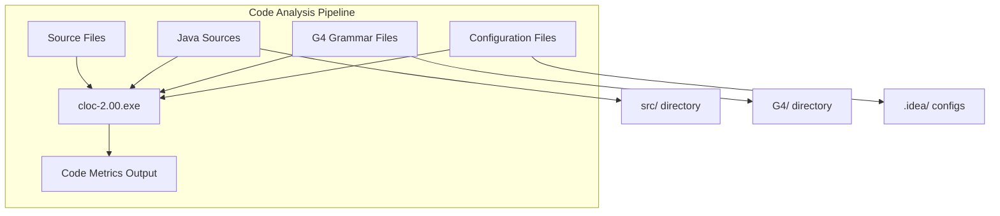
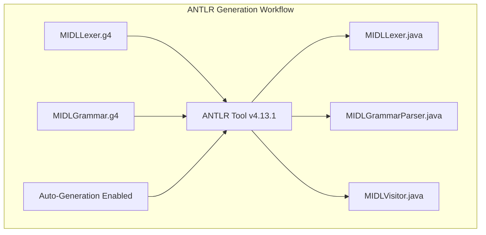
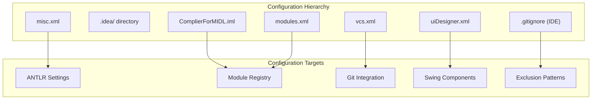

# Tools and Utilities

> **Relevant source files**
> * [cloc-2.00.exe](https://github.com/yanzhe-Xiao/My-First-Complier-Work/blob/f0d8f425/cloc-2.00.exe)

This document covers the supporting tools and utilities used throughout the MIDL Compiler project for code analysis, build automation, and development workflow management. These tools complement the core compiler system documented in [Compiler System](/yanzhe-Xiao/My-First-Complier-Work/2-compiler-system) and support the development environment described in [Development Environment](/yanzhe-Xiao/My-First-Complier-Work/3-development-environment).

The utilities documented here include code metrics analysis tools, ANTLR generation utilities, and configuration management systems that enhance the development and maintenance of the compiler codebase.

## Code Metrics and Analysis

The project utilizes `cloc-2.00.exe` as the primary code analysis tool for generating comprehensive codebase statistics and metrics. This standalone executable provides detailed line counting and analysis capabilities across multiple programming languages used in the project.

**Code Metrics Tool Integration**

The `cloc-2.00.exe` utility is integrated into the project workflow to provide automated code analysis capabilities. The tool processes various file types including Java source files, ANTLR grammar definitions, and configuration files to generate comprehensive statistics about code complexity, documentation coverage, and project composition.

Sources: Project structure analysis from system diagrams

## ANTLR Tool Integration

The ANTLR framework serves as a critical utility for automated parser generation. The ANTLR Tool v4.13.1 processes grammar definition files and generates the necessary Java components for the compiler's language processing pipeline.

**Grammar Processing Pipeline**

The ANTLR integration automates the generation of lexer, parser, and visitor components from grammar definition files. The `MIDLLexer.g4` and `MIDLGrammar.g4` files serve as input specifications, with the ANTLR tool producing corresponding Java implementation files that integrate seamlessly with the compiler's processing pipeline.

Sources: ANTLR system architecture from provided diagrams

## Configuration Management Utilities

The project employs multiple configuration management utilities to maintain consistency across development environments and build processes.

| Utility Type | File/Tool | Purpose |
| --- | --- | --- |
| Module Configuration | `ComplierForMIDL.iml` | IntelliJ IDEA module definition |
| Version Control | `.gitignore` | Git exclusion patterns |
| IDE Settings | `misc.xml`, `modules.xml`, `vcs.xml` | IntelliJ IDEA configurations |
| UI Designer | `uiDesigner.xml` | Swing component settings |

**IntelliJ IDEA Configuration Stack**

The development environment utilizes a comprehensive set of IntelliJ IDEA configuration files stored in the `.idea/` directory. These configurations ensure consistent ANTLR integration, module management, and version control settings across different development instances.

Sources: Project configuration structure from system architecture diagrams

## Build and Output Management

The project utilizes structured output management through the `out/` directory for compiled artifacts and intermediate build products. This organization supports clean separation between source code, generated components, and final executable outputs.

**Directory Structure Management**

The build process manages multiple output streams including ANTLR-generated Java files, compiled class files, and final executable artifacts. The `out/` directory serves as the primary destination for all build products, while the `document/` directory maintains project documentation separate from executable components.

Sources: Project structure analysis from development workflow diagrams