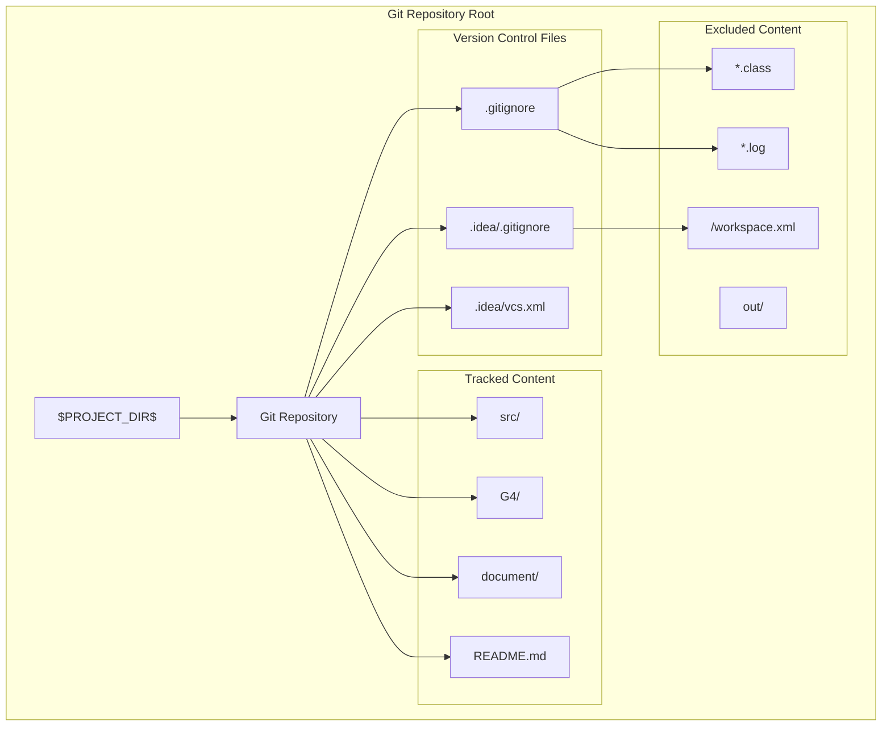
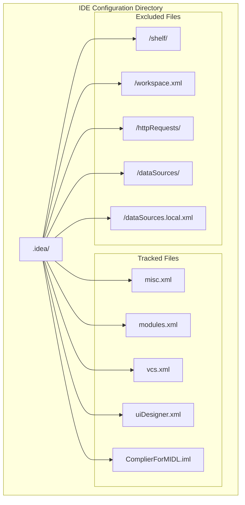
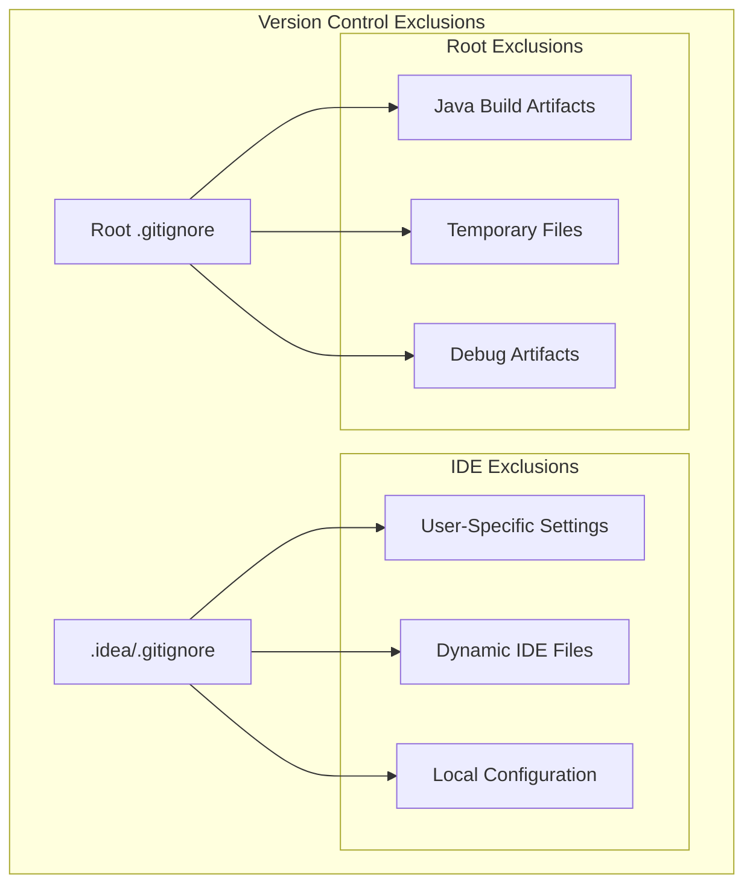

# Version Control Setup

> **Relevant source files**
> * [.gitignore](https://github.com/yanzhe-Xiao/My-First-Complier-Work/blob/f0d8f425/.gitignore)
> * [.idea/.gitignore](https://github.com/yanzhe-Xiao/My-First-Complier-Work/blob/f0d8f425/.idea/.gitignore)
> * [.idea/vcs.xml](https://github.com/yanzhe-Xiao/My-First-Complier-Work/blob/f0d8f425/.idea/vcs.xml)

This document covers the Git version control configuration for the MIDL Compiler project, including repository setup, file exclusion patterns, and IDE integration. The setup encompasses both project-level and development environment-specific version control configurations.

For information about the broader IntelliJ IDEA development environment configuration, see [IntelliJ IDEA Configuration](/yanzhe-Xiao/My-First-Complier-Work/3.1-intellij-idea-configuration).

## Git Repository Configuration

The project uses Git as its version control system with a standard repository structure. The VCS configuration is defined in the IntelliJ IDEA project settings, establishing the project root as the Git working directory.

### Repository Structure Diagram



The VCS directory mapping configuration establishes the relationship between the project directory and Git repository through the `VcsDirectoryMappings` component.

**Sources:** [.idea/vcs.xml L1-L6](https://github.com/yanzhe-Xiao/My-First-Complier-Work/blob/f0d8f425/.idea/vcs.xml#L1-L6)

## Root-Level File Exclusions

The primary `.gitignore` file defines exclusion patterns for Java compilation artifacts, temporary files, and development-related outputs that should not be tracked in version control.

### Java Compilation Exclusions

| Pattern | Description | Purpose |
| --- | --- | --- |
| `*.class` | Compiled Java bytecode files | Exclude build artifacts |
| `*.jar` | Java Archive files | Exclude packaged libraries |
| `*.war` | Web Application Archives | Exclude deployment artifacts |
| `*.ear` | Enterprise Application Archives | Exclude Java EE packages |

### Development Environment Exclusions

| Pattern | Description | Purpose |
| --- | --- | --- |
| `*.log` | Log files | Exclude runtime logs |
| `*.ctxt` | BlueJ context files | Exclude IDE-specific files |
| `.mtj.tmp/` | Mobile Tools for Java temporary directory | Exclude J2ME artifacts |

### System and Debug Exclusions

| Pattern | Description | Purpose |
| --- | --- | --- |
| `hs_err_pid*` | HotSpot error logs | Exclude JVM crash dumps |
| `replay_pid*` | JVM replay files | Exclude debug artifacts |
| `*.zip`, `*.tar.gz`, `*.rar` | Archive files | Exclude compressed artifacts |

**Sources:** [.gitignore L1-L25](https://github.com/yanzhe-Xiao/My-First-Complier-Work/blob/f0d8f425/.gitignore#L1-L25)

## IDE-Specific File Exclusions

The IntelliJ IDEA-specific `.gitignore` file manages exclusions for development environment files that are either user-specific or dynamically generated by the IDE.

### IDE Exclusion Hierarchy Diagram



### IDE Exclusion Categories

| Exclusion Path | Category | Reason |
| --- | --- | --- |
| `/shelf/` | Local changes | User-specific shelved changes |
| `/workspace.xml` | User preferences | Personal IDE workspace settings |
| `/httpRequests/` | Development tools | HTTP client request history |
| `/dataSources/` | Database connections | Database configuration files |
| `/dataSources.local.xml` | Local database config | User-specific database settings |

**Sources:** [.idea/.gitignore L1-L9](https://github.com/yanzhe-Xiao/My-First-Complier-Work/blob/f0d8f425/.idea/.gitignore#L1-L9)

## VCS Integration Configuration

The VCS integration is configured through the `vcs.xml` file, which establishes the mapping between the project directory and the Git version control system.

### VCS Component Structure

The configuration uses the `VcsDirectoryMappings` component to define version control associations:

```xml
<component name="VcsDirectoryMappings">
  <mapping directory="$PROJECT_DIR$" vcs="Git" />
</component>
```

This mapping establishes that:

* The project directory (`$PROJECT_DIR$`) variable references the root directory
* The version control system is identified as `Git`
* The mapping applies to the entire project scope

### Integration Points

The VCS configuration integrates with several IntelliJ IDEA subsystems:

1. **Project Structure**: Links with module definitions in `ComplierForMIDL.iml`
2. **ANTLR Integration**: Coordinates with ANTLR plugin settings in `misc.xml`
3. **Build System**: Integrates with compilation output management
4. **UI Components**: Works with GUI designer settings for form file versioning

**Sources:** [.idea/vcs.xml L1-L6](https://github.com/yanzhe-Xiao/My-First-Complier-Work/blob/f0d8f425/.idea/vcs.xml#L1-L6)

## File Exclusion Strategy

The project employs a two-tier exclusion strategy combining project-level and IDE-level patterns to maintain a clean repository while preserving essential configuration.

### Exclusion Pattern Hierarchy



This strategy ensures that:

* Essential project configuration remains version-controlled
* User-specific and temporary files are excluded
* Build artifacts and compilation outputs are ignored
* Database and development tool configurations remain local

**Sources:** [.gitignore L1-L25](https://github.com/yanzhe-Xiao/My-First-Complier-Work/blob/f0d8f425/.gitignore#L1-L25)

 [.idea/.gitignore L1-L9](https://github.com/yanzhe-Xiao/My-First-Complier-Work/blob/f0d8f425/.idea/.gitignore#L1-L9)