# 编译原理实验报告

## 2022302988 肖俨哲

### 实验 1

#### 实验背景

MIDL（Microsoft Interface Definition Language）是一种用于定义 COM（Component Object Model）接口的语言。为了构建一个 MIDL 编译器，词法和语法分析是两个关键步骤。Antlr4 是一款强大的开源工具，可以用来生成词法和语法分析器。通过定义词法和语法规则，可以使用 Antlr4 自动生成相应的解析程序，进一步生成抽象语法树（AST）。

#### 实验目的

-学习和掌握 Antlr4 的使用方法。

-定义 MIDL 语言的词法和语法规则。 -使用 Antlr4 生成 MIDL 语言的词法和语法分析程序。 -设计并生成 MIDL 语言的抽象语法树。 -构建一个从 MIDL 源代码到抽象语法树的分析程序，并输出格式化的抽象语法树。

#### 实验内容及流程

1. 词法规则语法规则的 G4 文件的书写

G4 文件部分内容：

```g4
lexer grammar MIDLLexer;

// 定义关键字
MODULE: [mM] [oO] [dD] [uU] [lL] [eE];
STRUCT: [sS] [tT] [rR] [uU] [cC] [tT];
BOOLEAN: [bB] [oO] [oO] [lL] [eE] [aA] [nN];
SHORT: [sS] [hH] [oO] [rR] [tT];
LONG: [lL] [oO] [nN] [gG];
UNSIGNED: [uU] [nN] [sS] [iI] [gG] [nN] [eE] [dD];
INT8: [iI] [nN] [tT] [8];
INT16: [iI] [nN] [tT] [1I][6];
INT32: [iI] [nN] [tT] [3I][2];
INT64: [iI] [nN] [tT] [6I][4];
UINT8: [uU] [iI] [nN] [tT] [8];
UINT16: [uU] [iI] [nN] [tT] [1I][6];
UINT32: [uU] [iI] [nN] [tT] [3I][2];
UINT64: [uU] [iI] [nN] [tT] [6I][4];
CHAR: [cC] [hH] [aA] [rR];
STRING: [sS] [tT] [rR] [iI] [nN] [gG];
FLOAT: [fF] [lL] [oO] [aA] [tT];
DOUBLE: [dD] [oO] [uU] [bB] [lL] [eE];
```

2. 构建从 MIDL 源代码到抽象语法树的分析程序
   使用生成的词法和语法分析程序，编写一个分析程序，并将抽象语法树输出到 SyntaxOut.txt 文件。

```java
@Override public String visitStruct_type(MIDLGrammar.Struct_typeContext ctx) {
        // 增加缩进
        level++;
        // 添加结构体开始
        ast.append(getIndentation()).append("struct ").append(ctx.ID().getText()).append(" {\n");

        // 遍历所有的 member_list 节点
        //并将结果添加到 AST 中
        visitMember_list(ctx.member_list());

        // 添加结构体结束
        ast.append(getIndentation()).append("}\n");

        // 减少缩进
        level--;
        return "";
    }
```

```java
package MIDL_AST;
import G4.MIDLLexer;
import G4.MIDLGrammar;
import org.antlr.v4.runtime.*;
import org.antlr.v4.runtime.tree.*;
public class TEST {


    public static void main(String[] args) {
        String input = "struct A{a::b c};";
        CharStream stream = CharStreams.fromString(input);

        // Create a lexer that feeds off of input CharStream
        MIDLLexer lexer = new MIDLLexer(stream);
        // Create a buffer of tokens pulled from the lexer
        CommonTokenStream tokens = new CommonTokenStream(lexer);
        // Create a parser that feeds off the tokens buffer
        MIDLGrammar parser = new MIDLGrammar(tokens);
        ParseTree tree = parser.specification();
        Format_AST format = new Format_AST();
        format.visit(tree);
        System.out.println(format.getAST());
    }
}
```

详见 readme.doc 文件
对于实验一，实现了缩进对于每条语法的判断。
为实验二进一步进行语义分析打下了基础

### 实验 2

#### 实验背景

本项目的目标是基于实验一的内容，完成语义分析模块，并生成对应的 C++代码，最终构建一个完整的 MIDL（Meta Interface Definition Language）到 C++的源到源编译器。编译器将能够检查和报告语义错误，生成抽象语法树，并通过 StringTemplate 模板生成目标代码。

#### 实验目标

1. **语义分析**：在语法分析基础上，增加语义分析功能，能够检查和报告三种语义错误，给出错误位置及错误类型。
2. **代码生成**：从抽象语法树生成对应的 C++代码，采用 StringTemplate 模板生成方式。
3. **测试和验证**：设计并实现语义分析和代码生成的测试用例，进行全面测试和验证。
4. **文档撰写**：提交详细的测试说明文档和实验报告。

#### 实验内容与流程

1. **语义分析模块设计与实现**

   - **功能描述**：实现对 MIDL 代码的语义分析，检测并报告以下三种语义错误：
     1. 变量未声明。
     2. 重复声明变量。
     3. 类型不匹配。
   - **错误报告**：在检测到错误时，报告错误位置（行号和列号）及错误类型。
   - **实现方法**：基于抽象语法树（AST）进行语义分析，通过遍历 AST 节点，检查变量声明和类型信息。

2. **抽象语法树（AST）到 C++代码的生成**

   - **规则总结**：依据提供的测试用例集，提炼抽象语法树节点到 C++代码的生成规则。
   - **代码生成方法**：使用 StringTemplate 模板生成目标 C++代码。学习并参考“StringTemplate 模板语法介绍”视频，编写模板和生成代码。
   - **具体步骤**：
     1. 定义 StringTemplate 模板。
     2. 将 AST 节点映射到模板中。
     3. 生成 C++代码。

3. **测试用例设计与验证**

   - **语义分析测试**：设计输入 MIDL 代码，包含预期的语义错误，验证语义分析模块的正确性。
   - **代码生成测试**：提供 MIDL 代码和预期输出 C++代码，验证生成的 C++代码与预期输出一致。

#### 具体实现细节

##### 1. **语义分析实现细节**

主要介绍一下作用域和数组的实现细节

###### visitScoped_name 方法详解

该 visitScoped_name 方法处理 MIDL 语法中的作用域名称（scoped name）的语义分析。这涉及解析命名空间、查找符号表以及处理未定义的结构体错误。

以下是详细的分解：

该方法重写了一个访客方法以处理作用域名称。上下文 (ctx) 提供了作用域名称的解析树节点。
命名空间解析：

```java
ArrayList<String> namespaces = new ArrayList<>();
int i;
if(ctx.getChild(0).getText().equals("::")){
    i = 1;
} else {
    i = 0;
}
for(; i < ctx.getChildCount(); i += 2){
    namespaces.add(ctx.getChild(i).getText());
}
namespaces.remove(namespaces.size() - 1);
```

创建一个 ArrayList 来存储命名空间。
如果第一个子节点是 "::"，从第二个子节点开始，否则从第一个子节点开始。
遍历子节点并添加命名空间标识符。
移除最后一个命名空间，因为它是标识符本身，不是命名空间。
模块名称设置：

```java
String moduleName = null;
if(!namespaces.isEmpty()){
    moduleName = namespaces.toString();
    if(moduleName != currentNode.getModuleName()){
        namespaces.add(0, currentNode.getModuleName().substring(1, currentNode.getModuleName().length() - 1));
    }
    moduleName = namespaces.toString();
} else {
    moduleName = currentNode.getModuleName();
}
```

如果命名空间不为空，将其转换为字符串作为模块名称。
如果模块名称与当前节点的模块名称不同，将当前节点的模块名称添加到命名空间列表的开头。
再次转换命名空间列表为字符串。
如果命名空间为空，直接使用当前节点的模块名称。
符号节点创建和查找：

```java
SymbolNode node = new SymbolNode();
node.setModuleName(moduleName);
node.setName(ctx.getChild(ctx.getChildCount() - 1).getText());
node.setType("struct");

SymbolNode result = symbolTable.lookupSt(node);
```

创建一个新的符号节点 SymbolNode。
设置符号节点的模块名称和名称。
将符号节点的类型设置为 "struct"。
在符号表中查找当前符号节点。
命名空间调整和查找：

```java
String spaces[] = node.getModuleName().split(",");
for(int k = 0; k < spaces.length; k++){
    spaces[k] = spaces[k].trim();
}

List<String> temp = Arrays.asList(spaces);
ArrayList<String> sp = new ArrayList<>(temp);
if(sp != null && sp.size() != 1){
    moduleName = null;
    for(int k = 1; k <= sp.size() - 2; k++){
        ArrayList<String> temp1 = new ArrayList<>(temp);
        temp1.remove(k);
        moduleName = temp1.toString().substring(1, temp1.toString().length() - 1);
        node.setModuleName(moduleName);
        result = symbolTable.lookupSt(node);
        if(result != null) {
            break;
        }
    }
}
```

将模块名称按逗号分割为数组，并去除空格。
将数组转换为列表并创建新的 ArrayList。
如果列表不为空且大小不为 1，进行命名空间调整。
遍历调整后的命名空间列表，尝试重新查找符号节点。
错误处理和类型设置：

```java
if(result == null){
    error.addError(ctx.getStart().getLine() + ":" + ctx.getStart().getCharPositionInLine(), "struct", node.getName(), Error.ErrorType.UNDEFINED, null, "The struct has not been defined before.");
} else {
    currentNode.setType(result.getModuleName() + "::" + result.getName());
}
return null;
```

如果在符号表中没有找到符号节点，添加一个未定义错误。
如果找到，设置当前节点的类型为结果的模块名称和名称。
方法返回 null，表示处理完成。

###### visitArray_declarator 方法详解

该 visitArray_declarator 方法用于处理 MIDL 语法中的数组声明的语义分析。这涉及检查重复定义、类型一致性以及确保数组初始化符合声明的大小。

该方法重写了一个访客方法以处理数组声明。上下文 (ctx) 提供了数组声明的解析树节点。
符号节点创建：

```java
SymbolNode sn = new SymbolNode();
sn.setName(ctx.getChild(0).getText());
sn.setStructName(currentNode.getStructName());
sn.setModuleName(currentNode.getModuleName());
```

创建一个新的符号节点 SymbolNode。
设置符号节点的名称为数组标识符。
将当前节点的结构名称和模块名称赋值给符号节点。
符号表查找：

SymbolNode res = symbolTable.lookupSt(sn);
在符号表中查找当前符号节点 sn。
如果找到相同名称和结构的符号，则表示该符号已被定义过，需要报错。
错误处理和类型设置：

```java
if (res != null) {
    error.addError(ctx.getStart().getLine() + ":" + ctx.getStart().getCharPositionInLine(), currentNode.getType(), ctx.getChild(0).getText(), Error.ErrorType.REDEFINED, null, null);
} else {
    sn.setType("Array<" + currentNode.getType() + ">");
}
```

如果在符号表中找到了相同的符号节点，添加一个重定义错误。
如果没有找到，设置符号节点的类型为当前类型的数组形式。
初始值处理：

```java
if (res == null) {
    sn.setVal(visit(ctx.getChild(2)));
    if (!isValLegal(sn, literalType.getLast())) {
        error.addError(ctx.getStart().getLine() + ":" + ctx.getStart().getCharPositionInLine(), "Array", sn.getName(), Error.ErrorType.TYPE_ERROR, null, "The type of the variable is not consistent with the type of the initial value.");
    } else {
        symbolTable.insertST(sn);
        if (ctx.getChildCount() > 4) {
            String val = visit(ctx.getChild(5));
            String valList[] = val.split(",");
            if (valList.length - 1 > Integer.parseInt(sn.getVal())) {
                error.addError(ctx.getStart().getLine() + ":" + ctx.getStart().getCharPositionInLine(), "Array", sn.getName(), Error.ErrorType.OVERFLOW, null, "The number of initial values is greater than the array size.");
            }
            for (int i = 1; i < valList.length; i++) {
                SymbolNode node = new SymbolNode();
                node.setName(sn.getName());
                node.setType(sn.getType());
                node.setModuleName(sn.getModuleName());
                node.setStructName(sn.getStructName());
                String lists[] = valList[i].split(":");
                node.setVal(lists[0]);
                if (!isValLegal(node, lists[1])) {
                    error.addError(ctx.getStart().getLine() + ":" + ctx.getStart().getCharPositionInLine(), "Array", node.getName(), Error.ErrorType.TYPE_ERROR, null, "The type of the variable is not consistent with the type of the initial value.");
                } else {
                    sn.setNext(node);
                    sn = node;
                    if (i == ctx.getChildCount() - 1)
                        sn.setNext(null);
                }
            }
        }
    }
}
```

如果符号表中不存在该符号节点，处理初始值。
通过访问第三个子节点获取数组大小，并进行合法性检查。
如果合法，将符号节点插入符号表。
如果有初始值列表，检查初始值的数量是否超过数组大小，并对每个初始值进行类型检查和合法性验证。
返回值：
return null;
该方法返回 null，表示处理完成。

##### 2. **代码生成实现细节**

入口方法（main）：

```java
public static void main(String[] args) throws IOException {
    String name = Check.inputFileName;
    name = name.replace("\"", "").replace("txt", "").replace(".", "");
    name = name.split("/")[2];
    catchAllMsg();
    generateHxxFile(name);
}
```

这是程序的入口方法，主要步骤包括获取输入文件名，调用 catchAllMsg 方法从符号表中提取信息，并调用 generateHxxFile 方法生成 hxx 文件。

提取符号表信息（catchAllMsg）：

```java
public static void catchAllMsg() throws IOException {
    Check.check();
    symbolTable = Check.semanticChecker.symbolTable;
    initializeEqualTypeMap();
    structs = new ArrayList<>();
    collectAllStructs();
}
```

该方法调用语义检查，并从符号表中提取所有结构体信息。初始化等价类型映射并收集所有结构体信息。

初始化等价类型映射（initializeEqualTypeMap）：

```java
private static void initializeEqualTypeMap() {
    equalType = new HashMap<>();
    equalType.put("int16", "short");
    equalType.put("int32", "long");
    equalType.put("int64", "long long");
    equalType.put("uint16", "unsigned short");
    equalType.put("uint32", "unsigned long");
    equalType.put("uint64", "unsigned long long");
}
```

该方法初始化了一个映射，将某些数据类型映射到对应的 C++类型。

收集所有结构体信息（collectAllStructs）：

```java
private static void collectAllStructs() {
    SymbolNode sn = new SymbolNode();
    sn.setType("struct");
    ArrayList<SymbolNode> allStructs = symbolTable.lookupAll(sn);

    for (SymbolNode snd : allStructs) {
        StructMsg smg = createStructMsg(snd);
        structs.add(smg);
    }
}
```

该方法从符号表中查找所有结构体，并为每个结构体创建一个 StructMsg 对象。

创建结构体信息（createStructMsg）：

```java
private static StructMsg createStructMsg(SymbolNode snd) {
    StructMsg smg = new StructMsg();
    String moduleName = (snd.getModuleName() != null) ? snd.getModuleName() : "";
    smg.setName(buildStructName(moduleName, snd.getName()));

    SymbolNode sn = new SymbolNode();
    sn.setStructName("[" + snd.getName() + "]");
    sn.setModuleName(snd.getModuleName());
    smg.setMembers(catchMembers(sn));
    smg.setScopeMembers(catchScopedMembers(sn));
    smg.setHasScoped(!smg.getScopeMembers().isEmpty());
    return smg;
}
```

该方法为每个结构体创建一个 StructMsg 对象，并设置结构体的名称、成员和作用域成员。

捕获成员信息（catchMembers）：

```java
public static ArrayList<MemberMsg> catchMembers(SymbolNode sn) {
    ArrayList<SymbolNode> allMembers = symbolTable.lookupAll(sn);
    ArrayList<MemberMsg> members = new ArrayList<>();
    for (SymbolNode snd : allMembers) {
        if (snd.getType().contains("::")) continue;
        members.add(createMemberMsg(snd));
    }
    return members;
}
```

该方法从符号表中查找所有成员，并为每个成员创建一个 MemberMsg 对象。

生成 hxx 文件（generateHxxFile）：

```java
private static void generateHxxFile(String name) throws IOException {
    String result = generateHxxContent(name);
    try (BufferedWriter bufferedWriter = Files.newBufferedWriter(Paths.get(OUTPUT_FILE_NAME))) {
        bufferedWriter.write(result);
    }
}
```

该方法生成 hxx 文件内容，并将其写入文件。

生成 hxx 文件内容（generateHxxContent）：

```java
private static String generateHxxContent(String name) {
    STGroup stg = new STGroupFile("./src/GenCode/Template.stg");
    ST headerST = stg.getInstanceOf("headerTemplate");
    headerST.add("fileName", name);

    ST bodyST = stg.getInstanceOf("bodyTemplate");
    bodyST.add("structs", structs);

    ST footerST = stg.getInstanceOf("footerTemplate");
    footerST.add("fileName", "hxx");

    return headerST.render() + "\n" + bodyST.render() + "\n" + footerST.render() + "\n";
}
```

该方法使用 StringTemplate 模板引擎生成 hxx 文件内容，包括头部、主体和尾部。

StringTemplate 模板语法
StringTemplate 是一个用于生成代码或文本的模板引擎。通过定义模板文件，可以灵活地生成目标代码。以下是使用 StringTemplate 生成 C++代码的步骤：

定义模板文件：
在./src/GenCode/Template.stg 中定义模板文件，包括头部模板、主体模板和尾部模板。例如：

```stg
headerTemplate(name) ::= <<
// This is the header for <name>
>>

bodyTemplate(structs) ::= <<
<structs:{s | struct <s.name> {
    <s.members:{m | <m.type> <m.name>;
    }>
} }>
>>

footerTemplate(name) ::= <<
// This is the footer for <name>
>>
```

加载模板文件：
`STGroup stg = new STGroupFile("./src/GenCode/Template.stg");`
获取模板实例并设置属性：

```java
ST headerST = stg.getInstanceOf("headerTemplate");
headerST.add("fileName", name);

ST bodyST = stg.getInstanceOf("bodyTemplate");
bodyST.add("structs", structs);

ST footerST = stg.getInstanceOf("footerTemplate");
footerST.add("fileName", "hxx");
```

渲染模板：
`return headerST.render() + "\n" + bodyST.render() + "\n" + footerST.render() + "\n";`
通过这些步骤，程序可以灵活地生成 C++代码，并且模板文件可以独立修改，而不影响程序的其他部分。这样提高了代码生成的灵活性和可维护性。

#### 语义分析测试用例举例说明

##### 1.命名冲突。

同一命名空间内，不能出现相同名字的接口定义。

```c++
struct A{
    short num;
    long num;
};
```

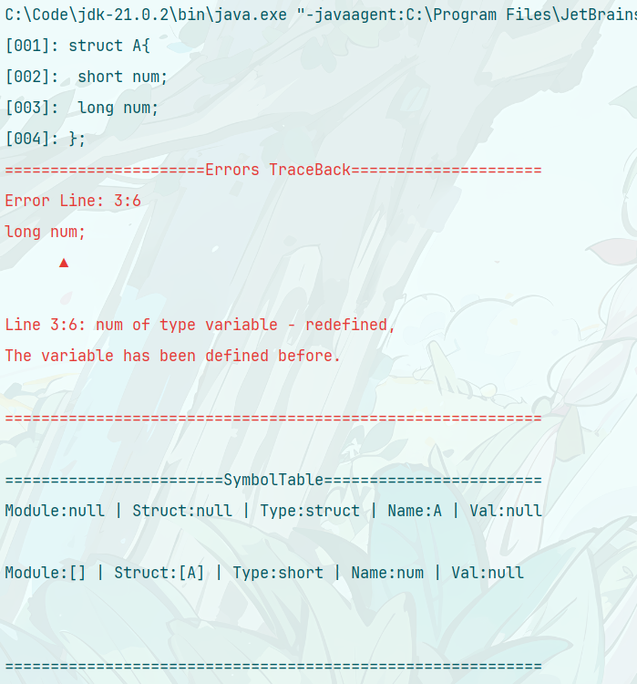

```c++
module  space{
struct A{
    short a;
    };
struct B{
    short a;
    };
};
```

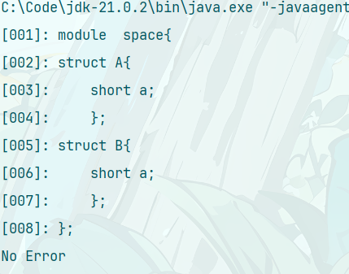

```c++
module  space{
	struct A{
    	short a;
	};
	struct A{
    	short b;
	};
};
```

##### 2.未定义即使用

struct 结构需要先定义才能使用。

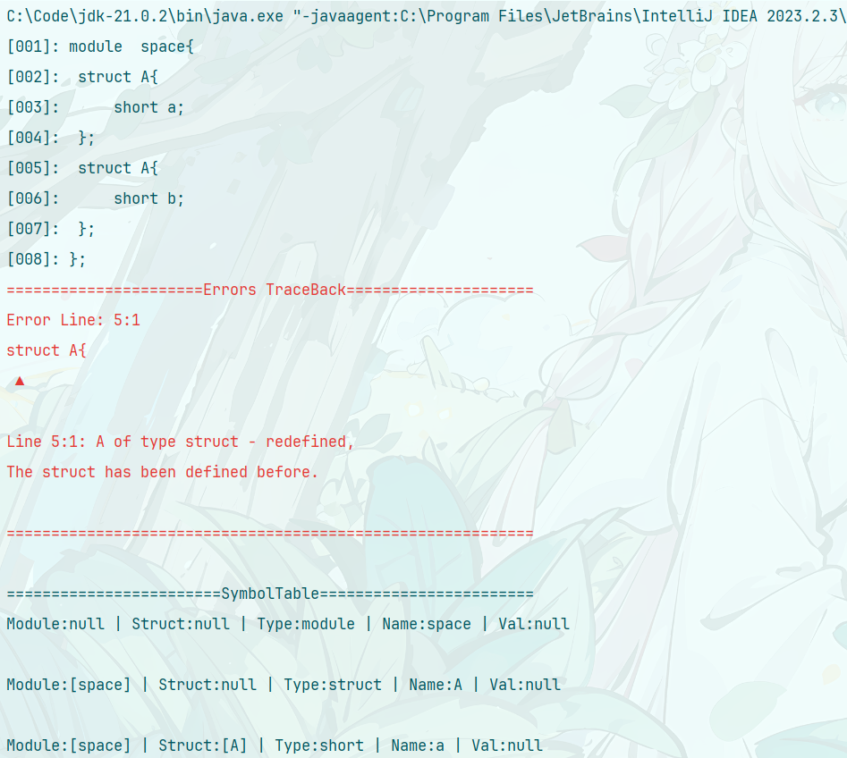

```c++
struct A{
	short a;
	B b;
};
```

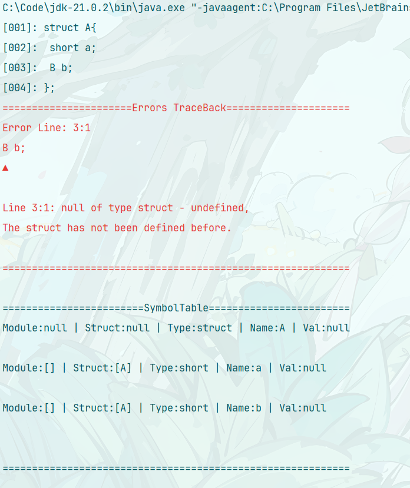

```c++
module space1{
struct B{
    int x;
    };
};
module space2{
    struct A{
    short a;
    B b;
    };
};
```

##### 3.字面量类型检查

字面量的数据类型需要和变量类型相同或兼容。
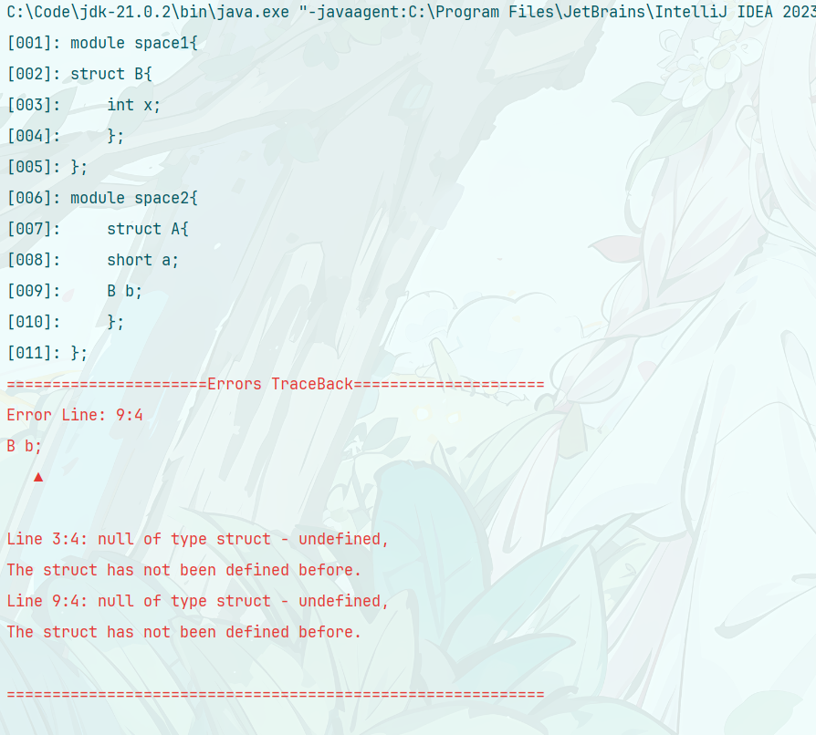

```c++
struct A{
	short a="a";
};
```

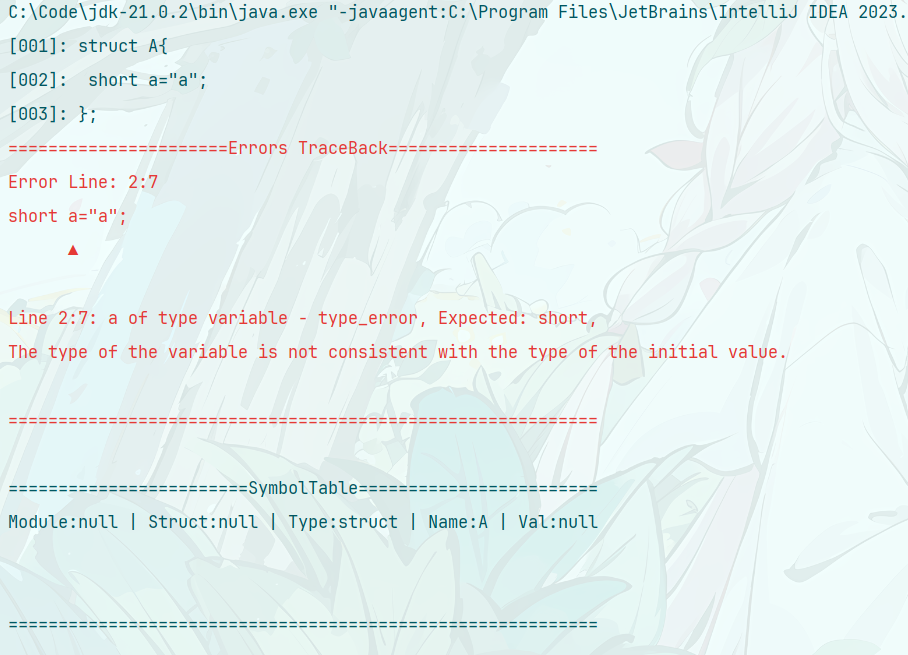

```c++
struct A{
	short a=100000;
};
```

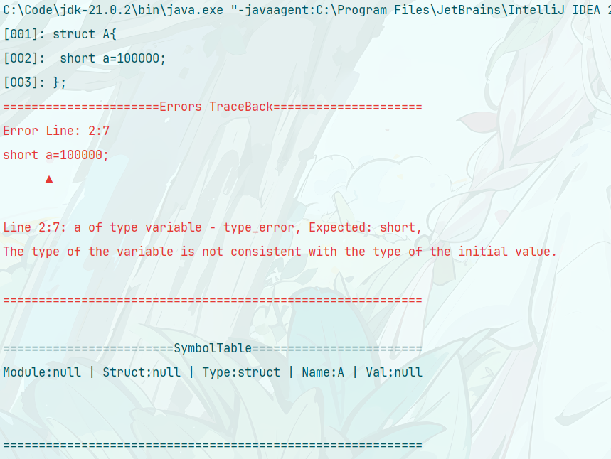

```c++
struct A{
    short a=15.24;
};
```

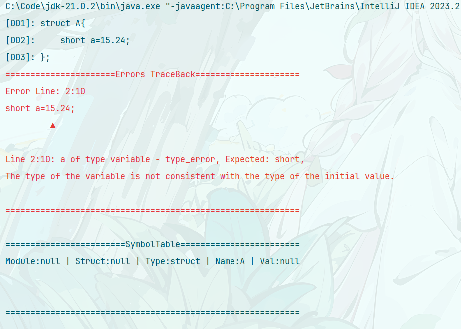

```c++
struct A{
    short a[4]=[10,12,45.34,"a"];
};

```

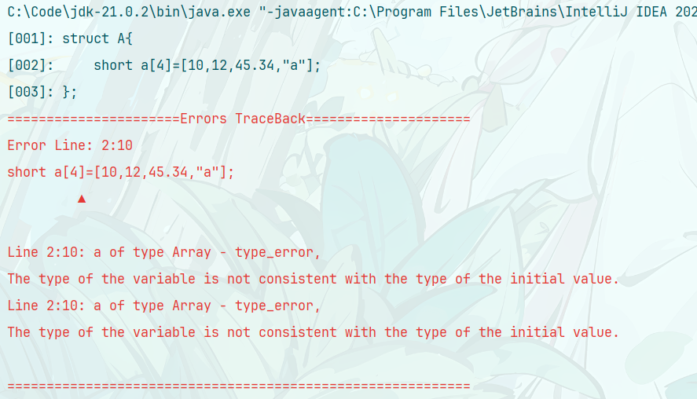

#### 代码生成测试用例

这是对五个测试用例的符号表，最后结果请查看 output 文件夹
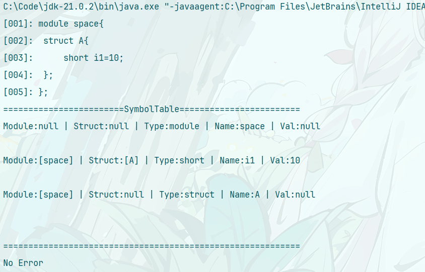
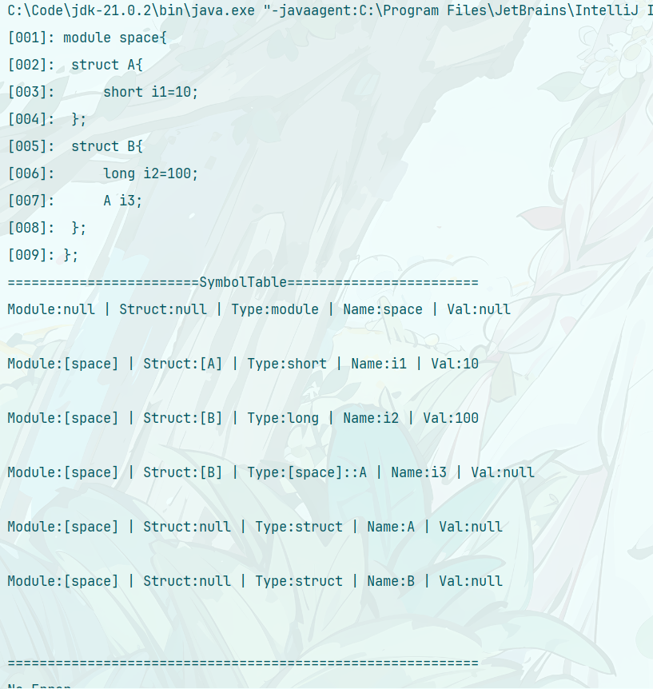
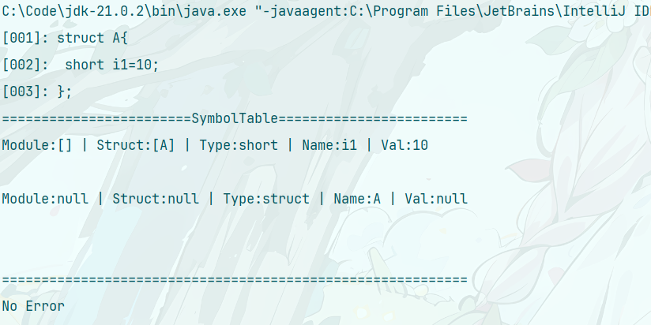
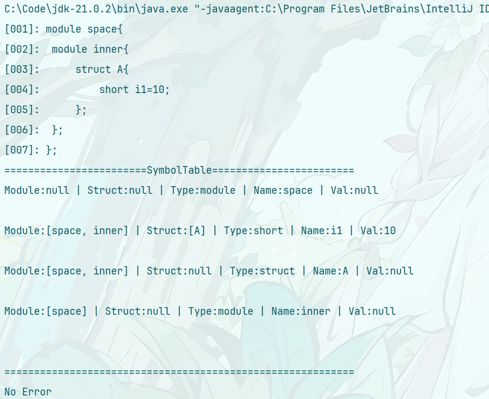


#### 结论

通过整合语义分析和代码生成模块，构建一个完整的 MIDL 到 C++的源到源编译器，详细记录实验过程及测试结果，为后续的开发和优化提供参考。提交的实验报告和测试说明文档将全面反映项目的技术实现和测试验证情况。

#### 问题

实验二中对命名空间的语义分析做了很久，考虑到

```java
module space{
    module space1{
	    struct A{
		    short a=10;
	    };
	};
	module space2{
	struct B{
		long c=100;
		space1::A d;
	};
	};
};
```

和

```java
module space{
	struct A{
		short a=10;
	};
	struct B{
		long c=100;
		A d;
	};
};
```

和

```java
module space{
    module space1{
	    struct A{
		    short a=10;
	    };
	};

	struct B{
		long c=100;
		space1::A d;
	};
};
```

三种情况的空间命名，对于字符串的拆分有一定的困难，最后也是解决了。
