## 语法规则每一句对应的抽象语法树

1.specification -> definition { definition }

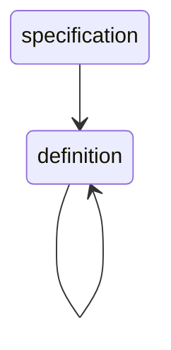

2.definiton -> type_decl “;”| module “;”

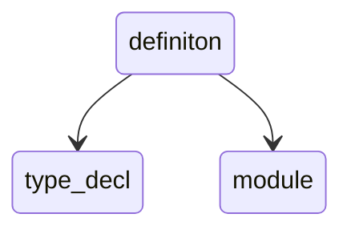

3.module -> “module”ID “{” definition { definition } “}”
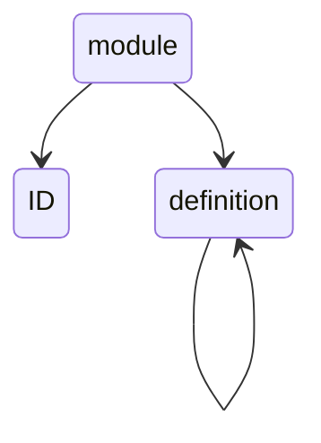

4.type_decl -> struct_type | “struct” ID
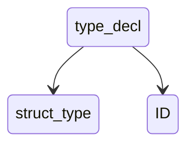
5.struct_type->“struct” ID “{” member_list “}”
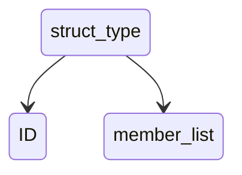
6.member_list-> { type_spec declarators “;” }
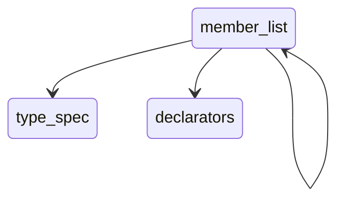
7.type_spec -> scoped_name | base_type_spec | struct_type
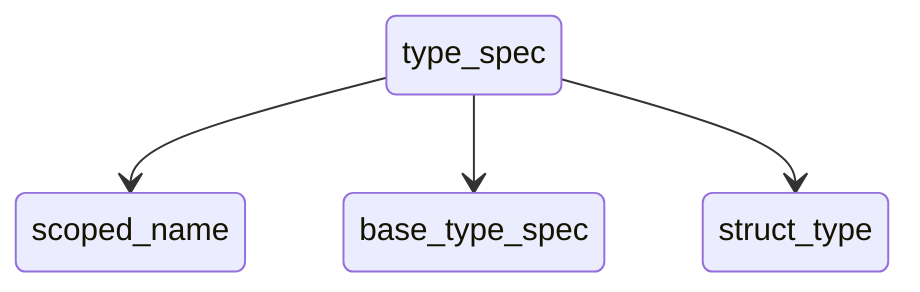
8.scoped_name -> [“::”] ID {“::” ID }
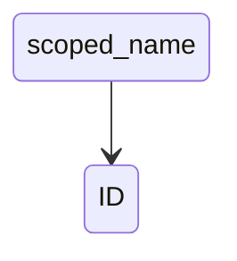
9.base_type_spec->floating_pt_type|integer_type|“char”|“string”|“boolean”
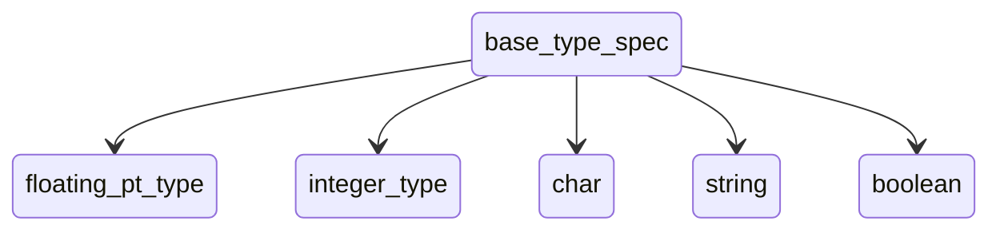
10.floating_pt_type -> “float” | “double” | “long double”
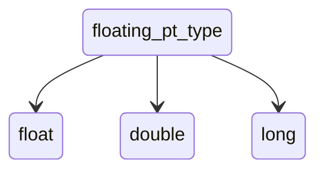
11.integer_type -> signed_int | unsigned_int
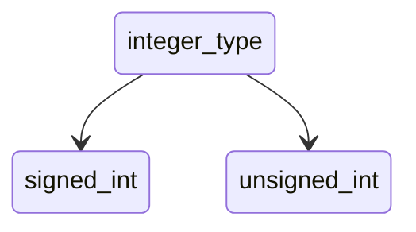
12.signed_int->(“short”|“int16”)|(“long”|“int32”)|(“long” “long”|“int64”)|“int8”
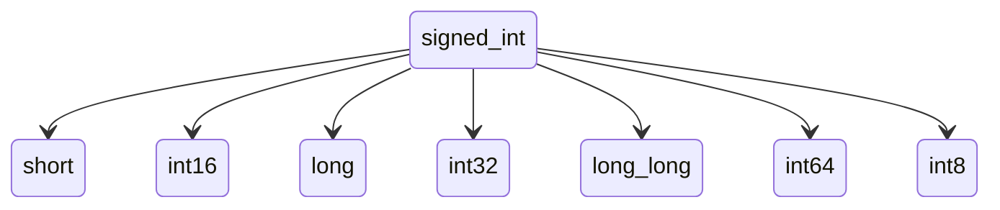
13.unsigned_int -> (“unsigned”“short”| “uint16”)| (“unsigned”“long”| “uint32”)| (“unsigned” “long” “long” | “uint64”)| “uint8”
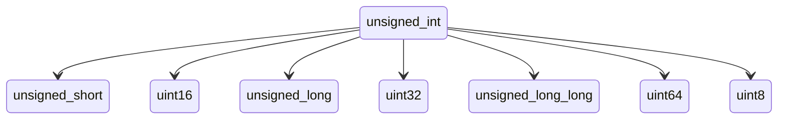
14.declarators -> declarator {“,” declarator }
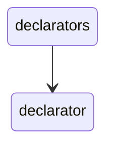
15.declarator -> simple_declarator | array_declarator
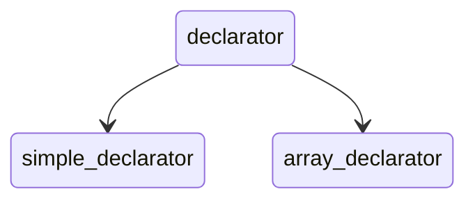
16.simple_declarator -> ID [“=” or_expr]
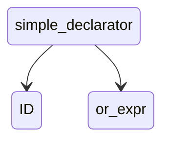
17.array_declarator -> ID “[” or_expr “]” [“=” exp_list ]
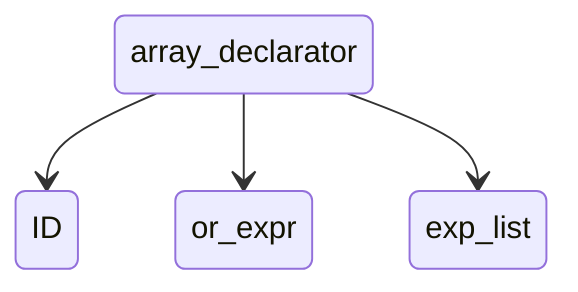
18.exp_list -> “[” or_expr { “,”or_expr } “]”
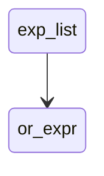
19.or_expr -> xor_expr {“|” xor_expr }
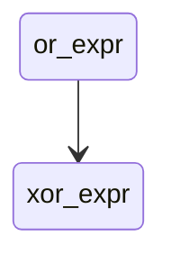
20.xor_expr -> and_expr {“^” and_expr }
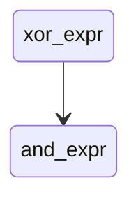
21.and_expr -> shift_expr {“&”shift_expr }
```mermaid
stateDiagram
and_expr --> shift_expr
```
22.shift_expr -> add_expr { (“>>” | “<<”) add_expr }
```mermaid
stateDiagram
shift_expr --> add_expr
```
23.add_expr -> mult_expr { (“+” | “-”) mult_expr }
```mermaid
stateDiagram
add_expr --> mult_expr
```
24.mult_expr -> unary_expr { (“\*” |“/”|“%”) unary_expr }
```mermaid
stateDiagram
mult_expr --> unary_expr
```
25.unary_expr -> [“-”| “+” | “~”] literal
```mermaid
stateDiagram
unary_expr --> literal
```
26.literal -> INTEGER | FLOATING_PT | CHAR | STRING | BOOLEAN
```mermaid
stateDiagram
literal --> INTEGER 
literal --> FLOATING_PT 
literal --> CHAR 
literal --> STRING 
literal --> BOOLEAN 
```

## 全部的整合

```mermaid
graph TD
    specification --> definition
    definition --> definition
    definition --> A
    definition --> module
    module --> |"module"|K
    module --> XYZ["}"] 
    module --> |"{"|definition
    A[type_decl]
    A --> B[struct_type]
    A -->  C
    B -->C["struct"]
    B --> K
    B -->D[member_list]
    D -->|"{"|E[type_spec]
    D -->F["}"]
    E -->G[scoped_name]
    E -->H[base_type_spec]
    E -->I[struct_type]
    G -->J["::"]
    J -->K[ID]
    H -->L[floating_pt_type]
    H -->M[integer_type]
    H -->N["char"]
    H -->O["string"]
    H -->P["boolean"]
    L -->Q["float"]
    L -->R["double"]
    L -->S["long double"]
    M -->T[signed_int]
    M -->U[unsigned_int]
    T -->V["short"]
    T -->W["int16"]
    T -->X["long"]
    T -->Y["int32"]
    T -->Z["long long"]
    T -->AA["int64"]
    T -->AB["int8"]
    U -->AC["unsigned short"]
    U -->AD["uint16"]
    U -->AE["unsigned long"]
    U -->AF["uint32"]
    U -->AG["unsigned long long"]
    U -->AH["uint64"]
    U -->AI["uint8"]
    D -->BI[declarators]
    BI -->BJ[";"]
    BI -->CK[declarator]
    CK -->CL[simple_declarator]
    CK -->CM[array_declarator]
    CL -->K
    CL -->CO[or_expr]
    CM -->K
    CM -->CQ["["]
    CM -->CR[or_expr]
    CM -->CS["]"]
    CM -->CT[exp_list]
    CT -->CU["["]
    CT -->CV[or_expr]
    CT -->CW[","]
    CT -->CX["]"]
    CR -->|"|"| CY[xor_expr]
    CR --> CY
    CY -->|"^"| CZ[and_expr]
    CY -->CZ
    CZ -->|"&"| DA[shift_expr]
    CZ -->DA
    DA -->|"<<|>>"|DB[add_expr]
    DA -->DB
    DB -->|"+ | -"| DC[mult_expr]
    DB -->DC
    DC -->|"*|/|%"| DD[unary_expr]
    DC -->DD
    DD -->|"-|+|~ (option)"| DE[literal]
    DD -->DE
    DE -->DF[INTEGER]
    DE -->DG[FLOATING_PT]
    DE -->DH[CHAR]
    DE -->DI[STRING]
    DE -->DJ[BOOLEAN]
```


